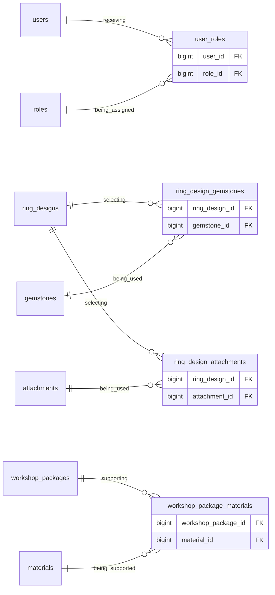

# ERD và mối quan hệ giữa các bảng — PPSWBS

Trạng thái: mô hình quan hệ theo **bản đề xuất trong [DB.md](../ppswbs-spec/DB.md)**, chưa phải toàn bộ schema đã triển khai. Tên bảng, khóa và tính bắt buộc/tùy chọn bên dưới bám theo tài liệu đó; các quyết định chưa chốt giữ nguyên `TBD`.

## 1. Cơ sở đối chiếu và phạm vi

| Nguồn | Nội dung đối chiếu |
| --- | --- |
| [DB.md](../ppswbs-spec/DB.md) | 23 bảng được đặc tả, PK/FK, unique, snapshot và ranh giới nghiệp vụ. Cơ sở cho sơ đồ chính. |
| [General Spec](../ppswbs-spec/spec-general.md) | Firebase xác thực danh tính; MySQL quản lý quyền và trạng thái; Guest không cần tài khoản. |
| [Authentication Data Model](../ppswbs-spec/features/001-member-authentication/data-model.md) và [migration V1](../ppswbs_backend/src/main/resources/db/migration/V1__init_member_auth.sql) | Phân biệt schema hiện có `members`, `workshop_bookings` với tên logic trong `DB.md`; xác nhận bảng token email riêng. |
| [Report 2 — Scope and Purpose](docs/report-2-project-management-plan/sections/02-i-project-overview/01-scope-purpose.md) | Checkout toàn bộ giỏ, snapshot giá, đề xuất giữ số lượng 15 phút, thanh toán đủ và giao nhận có bằng chứng. |
| [Report 3 — Use Cases](docs/report-3-software-requirement-specification/sections/03-i-overall-requirements/04-user-requirements/02-use-cases.md) | Booking nhóm, slot, package, thiết kế, vật liệu theo chi nhánh và quản lý tài khoản. |
| [Workshop workflow](docs/report-3-software-requirement-specification/assets/diagrams/workflows/10-workshop-booking-swimlane.puml), [Design workflow](docs/report-3-software-requirement-specification/assets/diagrams/workflows/11-ring-design-triage-swimlane.puml), [Retail workflow](docs/report-3-software-requirement-specification/assets/diagrams/workflows/12-ready-ring-retail-swimlane.puml), [Continuation workflow](docs/report-3-software-requirement-specification/assets/diagrams/details/26-continuation-custody-detail.puml) | Đối chiếu luồng nghiệp vụ và nhận diện khác biệt với mô hình đề xuất. |
| [Report 1 — Limitations](docs/report-1-project-introduction/sections/07-v-project-scope-limitations/02-limitations-exclusions.md) | Loyalty/marketing được hoãn; V1 không có quản lý kho đầy đủ hay tracking giao hàng. |

**Quy ước:**

- Giữ nguyên `delivery_infors`, `worshop_exceptions`, `shape` và `workshop_registration` theo `DB.md`. Sửa tên/migration là quyết định riêng.
- `users.user_id` là khóa tài khoản logic; `users.external_user_id` là Firebase UID duy nhất. Email không phải khóa định danh duy nhất và không tự tạo quan hệ/gộp tài khoản.
- Ánh xạ `users` sang `members`/`accounts`, và `workshop_registration` sang `workshop_bookings`, còn `TBD`. Sơ đồ này không đổi tên schema đang chạy.
- Sơ đồ chính chứa đúng 23 bảng của `DB.md`, gồm `loyalty_points`, `promotions`, `promotion_locations` thuộc **phạm vi tương lai/có điều kiện**; việc xuất hiện trong sơ đồ không đưa chúng vào V1.
- Sơ đồ bổ sung chỉ thể hiện bảng nối mà `DB.md` nêu là còn thiếu; chúng cần đặc tả trước triển khai.
- Sơ đồ hiển thị khóa và một số thuộc tính nghiệp vụ. Kiểu SQL, độ dài, default, index và danh sách cột đầy đủ xem `DB.md`.

## 2. Cách đọc quan hệ

| Ký hiệu Mermaid | Ý nghĩa ở đầu quan hệ |
| --- | --- |
| `||` | Đúng một bản ghi, bắt buộc. |
| `o|` hoặc `|o` | Không hoặc một bản ghi, tùy chọn. |
| `o{` hoặc `}o` | Không hoặc nhiều bản ghi. |
| `|{` hoặc `}|` | Một hoặc nhiều bản ghi. |
| `PK` / `FK` / `UK` | Khóa chính / khóa ngoại / khóa duy nhất. |

Ví dụ: `users |o--o{ workshop_registration` nghĩa là một user có thể có nhiều booking; mỗi booking gắn với tối đa một user và có thể không gắn user khi khách là Guest. FK nullable được ghi thêm bằng chú thích `NULL`.

Đường nối diễn tả cardinality; khóa xác định bản ghi đọc từ `PK`, không suy ra từ kiểu đường nối. Các cạnh riêng lẻ không biểu đạt được XOR của payment hoặc điều kiện phạm vi exception; xem mục 6.

## 3. ERD chính — 23 bảng trong DB.md

`roles`, `gemstones`, `attachments` đứng riêng trong sơ đồ chính vì chưa có bảng nối được đặc tả đầy đủ trong `DB.md`. Quan hệ dự kiến nằm ở mục 5.

```mermaid
erDiagram
    direction LR

    categories ||--o{ products : grouping
    products ||--o{ product_imgs : displaying
    users ||--o{ orders : placing
    users |o--o{ orders : recording_pickup
    orders ||--|{ order_items : containing
    products ||--o{ order_items : appearing_in
    orders |o--o{ payments : receiving_retail_attempts
    workshop_registration |o--o{ payments : receiving_deposit_attempts
    orders ||--o| delivery_infors : having_carrier_details
    users |o--o{ delivery_infors : recording_handoff

    workshop_locations ||--o{ slots : hosting
    slots ||--o{ workshop_registration : receiving
    workshop_packages ||--o{ workshop_registration : being_selected
    users |o--o{ workshop_registration : owning_as_member
    users |o--o{ workshop_registration : creating
    users |o--o{ workshop_registration : recording_checkin
    ring_designs |o--o{ workshop_registration : being_selected
    workshop_registration |o--o{ workshop_registration : continuing_from
    workshop_locations |o--o{ worshop_exceptions : scoping_by_location
    slots |o--o{ worshop_exceptions : scoping_by_slot
    users ||--o{ worshop_exceptions : creating

    materials ||--o{ ring_designs : supplying_base_material
    shape ||--o{ ring_designs : defining_base_form
    users |o--o{ ring_designs : creating
    ring_designs |o--o{ ring_designs : deriving_from
    users ||--o{ custom_design_requests : submitting
    users |o--o{ custom_design_requests : reviewing

    users ||--o{ loyalty_points : owning_ledger_entries
    users |o--o{ loyalty_points : recording_adjustments
    orders |o--o{ loyalty_points : causing_entries
    users ||--o{ promotions : creating
    promotions ||--o{ promotion_locations : applying_at
    workshop_locations ||--o{ promotion_locations : accepting
    users ||--o{ promotion_locations : enabling_at_location

    users {
        bigint user_id PK
        varchar external_user_id UK "Firebase UID"
        varchar email "NULL; not unique"
        varchar status
    }
    roles {
        bigint role_id PK
        varchar role_code UK
        varchar role_name
        boolean is_active
    }
    categories {
        bigint category_id PK
        varchar category_name UK
        boolean is_active
    }
    products {
        bigint product_id PK
        bigint category_id FK
        varchar product_name
        decimal unit_price
        char currency
        int available_to_sell_quantity
        boolean is_published
    }
    product_imgs {
        bigint product_img_id PK
        bigint product_id FK
        text img_url
        int sort_order
    }
    orders {
        bigint order_id PK
        varchar order_code UK
        bigint member_user_id FK
        bigint picked_up_by_user_id FK "NULL"
        varchar fulfilment_method "NULL before selection"
        varchar status
        decimal total_amount
        char currency
        datetime hold_expires_at "NULL; lifecycle TBD"
    }
    order_items {
        bigint order_item_id PK
        bigint order_id FK
        bigint product_id FK
        varchar product_name_snapshot
        int quantity
        decimal unit_price
        decimal line_amount
    }
    payments {
        bigint payment_id PK
        varchar payment_code UK
        bigint order_id FK "NULL; XOR target"
        bigint workshop_registration_id FK "NULL; XOR target"
        varchar payment_purpose
        decimal amount
        char currency
        varchar provider
        varchar provider_transaction_id "NULL; uniqueness TBD"
        varchar status
        datetime verified_at "NULL until verified"
    }
    delivery_infors {
        bigint delivery_infor_id PK
        bigint order_id FK, UK
        varchar recipient_name
        varchar recipient_phone
        text delivery_address
        varchar carrier_name "NULL before handoff"
        varchar handoff_reference "NULL before handoff"
        bigint handed_off_by_user_id FK "NULL before handoff"
        datetime handed_off_at "NULL before handoff"
    }
    workshop_locations {
        bigint location_id PK
        varchar location_code UK
        varchar location_name
        varchar timezone
        boolean is_active
    }
    slots {
        bigint slot_id PK
        bigint location_id FK
        date slot_date
        time start_time
        time end_time
        int capacity "NULL until configured"
        boolean is_open
    }
    workshop_packages {
        bigint workshop_package_id PK
        varchar package_code UK
        varchar package_name
        decimal price
        char currency
        decimal deposit_percentage
        boolean is_published
    }
    workshop_registration {
        bigint workshop_registration_id PK
        varchar booking_code UK
        bigint member_user_id FK "NULL for Guest"
        bigint slot_id FK
        bigint workshop_package_id FK
        bigint ring_design_id FK "NULL"
        bigint parent_registration_id FK "NULL; self-reference"
        bigint created_by_user_id FK "NULL; required for continuation"
        bigint checked_in_by_user_id FK "NULL before checkin"
        varchar contact_email
        int participant_count
        decimal package_price_snapshot
        decimal total_amount
        decimal deposit_amount
        char currency
        varchar confirmation_state
        varchar status
    }
    worshop_exceptions {
        bigint workshop_exception_id PK
        bigint location_id FK "NULL for global scope"
        bigint slot_id FK "NULL for whole-day scope"
        bigint created_by_user_id FK
        date exception_date
        boolean is_closed
        int capacity_override "NULL"
        boolean is_active
    }
    ring_designs {
        bigint ring_design_id PK
        bigint created_by_user_id FK "NULL for permitted Guest"
        bigint source_design_id FK "NULL; self-reference"
        bigint material_id FK
        bigint shape_id FK
        varchar design_type
        varchar ring_size "NULL"
        json component_snapshot
        decimal estimated_price "NULL until evaluated"
        varchar rules_version
        varchar status
    }
    materials {
        bigint material_id PK
        varchar material_code UK
        varchar material_name
        decimal unit_price
        varchar price_unit
        char currency
        boolean is_active
    }
    shape {
        bigint shape_id PK
        varchar shape_code UK
        varchar shape_name
        decimal price_adjustment "NULL"
        boolean is_active
    }
    gemstones {
        bigint gemstone_id PK
        varchar gemstone_code UK
        varchar gemstone_name
        decimal unit_price
        varchar price_unit
        char currency
        boolean is_active
    }
    attachments {
        bigint attachment_id PK
        varchar attachment_code UK
        varchar attachment_name
        decimal unit_price
        varchar price_unit
        char currency
        boolean is_active
    }
    custom_design_requests {
        bigint custom_design_request_id PK
        bigint member_user_id FK
        bigint reviewed_by_user_id FK "NULL before review"
        text request_description
        text img_url "Exactly one reference image"
        varchar status
        text review_reason "Required for rejection"
    }
    loyalty_points {
        bigint loyalty_point_id PK
        bigint member_user_id FK
        bigint order_id FK "NULL"
        bigint recorded_by_user_id FK "NULL for system event"
        varchar event_key UK
        varchar entry_type
        bigint points_delta
        datetime created_at
    }
    promotions {
        bigint promotion_id PK
        bigint created_by_user_id FK
        varchar promotion_name
        varchar voucher_code UK "NULL allowed"
        varchar discount_type
        decimal discount_value
        datetime starts_at
        datetime ends_at
        boolean is_active
    }
    promotion_locations {
        bigint promotion_id PK, FK
        bigint location_id PK, FK
        bigint created_by_user_id FK
        datetime created_at
    }
```

## 4. Mô tả chi tiết mối quan hệ

**A → B: `1 : 0..N`** nghĩa là mỗi B có đúng một A, còn mỗi A có thể chưa có B hoặc có nhiều B. **`0..1 : 0..N`** cho phép B không có A vì FK nullable. Với nhiều FK cùng trỏ `users`, mỗi dòng thể hiện một vai trò riêng.

### 4.1. Sản phẩm, đơn hàng, thanh toán và giao nhận

| Bảng cha → bảng con | A : B | FK ở bảng con → khóa tham chiếu | Ý nghĩa / ràng buộc |
| --- | --- | --- | --- |
| `categories` → `products` | `1 : 0..N` | `products.category_id` → `categories.category_id` | Mỗi sản phẩm thuộc một danh mục theo đề xuất hiện tại; một danh mục có nhiều sản phẩm. |
| `products` → `product_imgs` | `1 : 0..N` | `product_imgs.product_id` → `products.product_id` | Nhiều ảnh; unique `(product_id, sort_order)` giữ thứ tự. Số ảnh tối thiểu khi publish còn `TBD`. |
| `users` → `orders` (người mua) | `1 : 0..N` | `orders.member_user_id` → `users.user_id` | Order thuộc một Member; Guest không được checkout retail. FK không tự chứng minh quyền Member. |
| `users` → `orders` (pickup) | `0..1 : 0..N` | `orders.picked_up_by_user_id` → `users.user_id` | Nullable trước pickup; là người vận hành ghi nhận giao hàng tại cửa hàng, không phải người mua. |
| `orders` → `order_items` | `1 : 1..N` | `order_items.order_id` → `orders.order_id` | Mỗi order có ít nhất một dòng. FK không bảo đảm số dòng tối thiểu; checkout phải tạo order và items trong cùng transaction. |
| `products` → `order_items` | `1 : 0..N` | `order_items.product_id` → `products.product_id` | Sản phẩm xuất hiện trong nhiều đơn; mỗi dòng lưu snapshot. Unique `(order_id, product_id)` gộp số lượng cùng sản phẩm. |
| `orders` → `payments` | `0..1 : 0..N` | `payments.order_id` → `orders.order_id` | Một order có nhiều attempt; payment trỏ order khi purpose là `retail_full_payment`. Kết hợp XOR với booking. |
| `workshop_registration` → `payments` | `0..1 : 0..N` | `payments.workshop_registration_id` → `workshop_registration.workshop_registration_id` | Booking có nhiều attempt cọc; purpose `workshop_deposit`. Guest payment không cần user FK. |
| `orders` → `delivery_infors` | `1 : 0..1` | `delivery_infors.order_id` → `orders.order_id` | FK required + unique: mỗi order tối đa một bản ghi giao hàng. Carrier cần thông tin giao hàng; pickup không cần. |
| `users` → `delivery_infors` (handoff) | `0..1 : 0..N` | `delivery_infors.handed_off_by_user_id` → `users.user_id` | Nullable trước handoff; bắt buộc cùng carrier, reference và thời gian khi hoàn tất bàn giao. |

`orders` và `products` có quan hệ **N–N qua `order_items`**. Đây là bảng dòng hàng có số lượng và giá snapshot, không chỉ chứa hai ID.

### 4.2. Chi nhánh, slot, gói workshop và booking

| Bảng cha → bảng con | A : B | FK ở bảng con → khóa tham chiếu | Ý nghĩa / ràng buộc |
| --- | --- | --- | --- |
| `workshop_locations` → `slots` | `1 : 0..N` | `slots.location_id` → `workshop_locations.location_id` | Slot là một phiên có ngày tại một chi nhánh. Unique `(location_id, slot_date, start_time)`. |
| `slots` → `workshop_registration` | `1 : 0..N` | `workshop_registration.slot_id` → `slots.slot_id` | Slot nhận nhiều booking, trong giới hạn tổng số người theo trạng thái/hold đã duyệt. |
| `workshop_packages` → `workshop_registration` | `1 : 0..N` | `workshop_registration.workshop_package_id` → `workshop_packages.workshop_package_id` | Booking chọn một gói; gói dùng cho nhiều booking. Giá/tên/tỷ lệ cọc được snapshot khi đặt. |
| `users` → `workshop_registration` (Member) | `0..1 : 0..N` | `workshop_registration.member_user_id` → `users.user_id` | Guest để null. Import Guest booking cần xác minh email, xác nhận rõ và entitlement, không tự nối theo email. |
| `users` → `workshop_registration` (người tạo) | `0..1 : 0..N` | `workshop_registration.created_by_user_id` → `users.user_id` | Actor tạo booking khi có đăng nhập; bắt buộc là Staff được phép khi tạo continuation. |
| `users` → `workshop_registration` (check-in) | `0..1 : 0..N` | `workshop_registration.checked_in_by_user_id` → `users.user_id` | Actor check-in nhóm; nullable trước check-in. Không đại diện cho từng người tham gia. |
| `ring_designs` → `workshop_registration` | `0..1 : 0..N` | `workshop_registration.ring_design_id` → `ring_designs.ring_design_id` | Booking chọn tối đa một mẫu/configuration; có thể null khi tư vấn tại chỗ. Không trỏ yêu cầu ảnh tùy chỉnh. |
| `workshop_registration` → chính nó | `0..1 : 0..N` | `parent_registration_id` → `workshop_registration_id` | Continuation có tối đa một booking gốc; booking gốc có thể có nhiều continuation. Cấm tự tham chiếu và chu trình. |
| `workshop_locations` → `worshop_exceptions` | `0..1 : 0..N` | `worshop_exceptions.location_id` → `workshop_locations.location_id` | Nullable cho ngoại lệ toàn hệ thống; có ID cho phạm vi chi nhánh hoặc slot. |
| `slots` → `worshop_exceptions` | `0..1 : 0..N` | `worshop_exceptions.slot_id` → `slots.slot_id` | Nullable cho ngoại lệ cả ngày; có ID khi áp dụng cho một slot. |
| `users` → `worshop_exceptions` | `1 : 0..N` | `worshop_exceptions.created_by_user_id` → `users.user_id` | Actor được phép cấu hình ngoại lệ lịch. |

Chi nhánh của booking được suy ra qua `workshop_registration.slot_id` → `slots.location_id` → `workshop_locations.location_id`. `DB.md` không có location FK trực tiếp trên booking, nên sơ đồ không thêm FK dư thừa.

### 4.3. Thiết kế nhẫn và yêu cầu thiết kế ảnh

| Bảng cha → bảng con | A : B | FK ở bảng con → khóa tham chiếu | Ý nghĩa / ràng buộc |
| --- | --- | --- | --- |
| `materials` → `ring_designs` | `1 : 0..N` | `ring_designs.material_id` → `materials.material_id` | Một vật liệu nền/design theo đề xuất single-base-material; đa vật liệu còn `TBD`. |
| `shape` → `ring_designs` | `1 : 0..N` | `ring_designs.shape_id` → `shape.shape_id` | Một hình dạng nền/design; không phải kiểu cắt đá hoặc kích thước nhẫn. |
| `users` → `ring_designs` | `0..1 : 0..N` | `ring_designs.created_by_user_id` → `users.user_id` | Tác giả mẫu/người tạo cấu hình. Nullable cho Guest được phép; không có nghĩa thiết kế công khai. |
| `ring_designs` → chính nó | `0..1 : 0..N` | `source_design_id` → `ring_design_id` | Dẫn xuất từ mẫu/phiên bản trước; một nguồn có nhiều bản dẫn xuất. Cấm tự tham chiếu và chu trình. |
| `users` → `custom_design_requests` (người gửi) | `1 : 0..N` | `custom_design_requests.member_user_id` → `users.user_id` | Chỉ Member gửi; mỗi request có mô tả và đúng một ảnh tham chiếu. |
| `users` → `custom_design_requests` (người duyệt) | `0..1 : 0..N` | `custom_design_requests.reviewed_by_user_id` → `users.user_id` | Nullable trước duyệt; accepted/rejected phải ghi reviewer, thời gian; rejected cần lý do. |

**Ranh giới giữ nguyên từ `DB.md`:** `custom_design_requests` là luồng gửi/duyệt độc lập, không liên kết với `ring_designs`, `workshop_registration`, `orders`, `payments`, pricing, fulfilment hoặc AI. Accepted không tự tạo thiết kế, booking hay đơn mua. Các workflow mô tả image/AI/quote rộng hơn cần được thống nhất riêng trước khi thay đổi ranh giới này.

### 4.4. Loyalty và promotion — tương lai/có điều kiện

| Bảng cha → bảng con | A : B | FK ở bảng con → khóa tham chiếu | Ý nghĩa / ràng buộc |
| --- | --- | --- | --- |
| `users` → `loyalty_points` (Member) | `1 : 0..N` | `loyalty_points.member_user_id` → `users.user_id` | Nhiều bút toán bất biến; số dư bằng tổng `points_delta`. |
| `users` → `loyalty_points` (actor) | `0..1 : 0..N` | `loyalty_points.recorded_by_user_id` → `users.user_id` | Actor cho điều chỉnh thủ công; event hệ thống có thể null. |
| `orders` → `loyalty_points` | `0..1 : 0..N` | `loyalty_points.order_id` → `orders.order_id` | Order có thể gây nhiều bút toán; entry khác có thể để null. Unique `event_key` chống ghi lặp. |
| `users` → `promotions` | `1 : 0..N` | `promotions.created_by_user_id` → `users.user_id` | Actor tạo chương trình; quyền quản lý cụ thể còn `TBD`. |
| `promotions` → `promotion_locations` | `1 : 0..N` | `promotion_locations.promotion_id` → `promotions.promotion_id` | Chương trình được bật tại từng chi nhánh bằng bản ghi liên kết. |
| `workshop_locations` → `promotion_locations` | `1 : 0..N` | `promotion_locations.location_id` → `workshop_locations.location_id` | Chi nhánh có nhiều chương trình; PK ghép `(promotion_id, location_id)` chống gán trùng. |
| `users` → `promotion_locations` | `1 : 0..N` | `promotion_locations.created_by_user_id` → `users.user_id` | Actor bật promotion tại chi nhánh, không phải người hưởng ưu đãi/chủ sở hữu chương trình. |

`promotions` và `workshop_locations` có quan hệ **N–N qua `promotion_locations`**. Không có dòng liên kết nghĩa là không áp dụng tại chi nhánh đó, không phải toàn hệ thống. Chưa có đặc tả promotion usage/order, nên không vẽ cạnh `promotions` → `orders`.

## 5. Quan hệ bổ sung đã được nêu nhưng chưa đặc tả đầy đủ

**Sơ đồ đề xuất, tách khỏi 23 bảng chính.** Tên bốn bảng nối đã được `DB.md` nhắc đến. Các FK thể hiện quan hệ dự kiến; không tự chốt PK, actor, lifecycle hoặc unique chưa có bằng chứng. Quantity phải dương cho đá/phụ kiện; kiểu SQL và đơn vị cần đặc tả nên chưa vẽ cột quantity.

| Quan hệ dự kiến | Bảng nối | Cơ sở / phần cần bổ sung |
| --- | --- | --- |
| `users` ↔ `roles`: N–N | `user_roles` | Unique `(user_id, role_id)`; cần trạng thái cấp/thu hồi và audit. PK, actor/timestamp, ánh xạ `account_roles` còn `TBD`. Không dùng `users.role_id` thay mô hình đa vai trò. |
| `ring_designs` ↔ `gemstones`: N–N | `ring_design_gemstones` | Design FK, gemstone FK, quantity dương. Design không có đá có 0 selection. PK/unique theo variant, kích thước, vị trí còn `TBD`; không mặc định mỗi cặp design/stone chỉ có một dòng. |
| `ring_designs` ↔ `attachments`: N–N | `ring_design_attachments` | Design FK, attachment FK, quantity dương. Design không có phụ kiện có 0 selection. PK, vị trí, variant uniqueness còn `TBD`. |
| `workshop_packages` ↔ `materials`: N–N dự kiến | `workshop_package_materials` | Gói có nhiều vật liệu; vật liệu dùng cho nhiều gói. Cần đặc tả cấu trúc, unique, compatibility; không thêm một `material_id` tùy ý vào package. |

`DB.md` còn yêu cầu quan hệ **vật liệu theo chi nhánh** và **gói workshop hợp lệ theo chi nhánh**, nhưng chưa chốt bảng/cột. Chúng cần thiết khi lọc package/design theo location; `is_active` toàn cục không thay thế các quan hệ này. Chưa đưa tên bảng tự đặt vào ERD chính.

## 6. Quy tắc không thể thể hiện chỉ bằng đường nối

| Nhóm | Quy tắc cần bảo đảm |
| --- | --- |
| Payment target — XOR | Chính xác một trong `payments.order_id`, `payments.workshop_registration_id` khác null. Retail: có order, không booking, purpose `retail_full_payment`. Workshop: có booking, không order, purpose `workshop_deposit`. Cấm cả hai null/cả hai có giá trị. |
| Payment attempts | Target có nhiều attempt, không phải 1–1. Chỉ outcome gateway xác minh hợp lệ, đúng target/amount/currency được chấp nhận; callback lặp không thu tiền/trừ số lượng/xác nhận lần nữa. Redirect không phải bằng chứng thanh toán. |
| Delivery | `order_id` required + unique bảo đảm tối đa một record/order. Record chỉ thuộc order đã thanh toán đủ, chọn carrier. Handoff cần carrier name, reference, actor, timestamp; phí carrier ngoài order. |
| Group capacity | Tính theo tổng `participant_count` của booking/hold đủ điều kiện, không theo số dòng booking. `actual_participant_count` là số check-in thực tế, không thay số đã đặt. |
| Exception scope | Global/date: location và slot null. Location/date: có location, slot null. Slot: cả hai có giá trị; location/date phải khớp slot. Có slot nhưng location null không hợp lệ theo đề xuất. |
| Exception uniqueness | Unique `(location_id, exception_date, slot_id)` thông thường không xử lý đủ tổ hợp null. Cần enforcement cho một exception active/cùng phạm vi/ngày; precedence slot → location → global còn `TBD`. |
| Self-reference | `parent_registration_id`, `source_design_id` không trỏ chính bản ghi/không tạo chu trình. Parent booking không tự giữ slot kế tiếp, tái dùng cọc hay chứng minh có custody record. |
| Snapshots | Order item, booking và design đã frozen giữ snapshot; thay giá/tên catalogue, profile, component không viết lại lịch sử. JSON không thay FK/compatibility validation. |
| Authorization | FK trỏ `users` chỉ kiểm tra tài khoản tồn tại. Quyền Member/Staff/Owner, trạng thái và policy acceptance phải được use case kiểm tra riêng. |
| Retention | Giữ master data/identity đang được lịch sử tham chiếu; ngừng sử dụng bằng unpublish/deactivate/archive theo domain. Không tự chọn cascade delete giao dịch. Retention cụ thể còn `TBD`. |
| Loyalty/promotion | Chưa kích hoạt trong V1. Ledger immutable, unique event; ưu đãi cần policy, snapshot, usage record riêng. Các bảng hiện có chưa đủ để chốt tiền giảm/đồng thời redeem. |

## 7. Khoảng trống và khác biệt cần chốt trước triển khai

| Vấn đề | Bằng chứng / giới hạn |
| --- | --- |
| Logical và physical schema | Migration V1 tạo `members`, `policy_documents`, `member_policy_acceptances`, `member_auth_audit_events`, `workshop_bookings`, `booking_email_confirmations`. Không coi 23 bảng trong sơ đồ là đã triển khai. Ánh xạ identity/booking và migration tiếp theo còn `TBD`. |
| Email confirmation | Schema hiện có: `members.id` → `workshop_bookings.member_id` nullable; `workshop_bookings.id` → `booking_email_confirmations.booking_id` required + unique, mỗi booking tối đa một confirmation record. Mapping confirmation sang `workshop_registration` chưa chốt; không tự thêm FK giữa hai schema. Token hash/expiry ở bảng riêng. |
| Policy và audit | Acceptance có FK đến `members`, `policy_documents`, unique `(member_id, policy_document_id)`. `member_auth_audit_events.member_id` nullable nhưng migration V1 không khai báo FK; không suy diễn thành FK đã có. Các record này và role-change audit ngoài 23 bảng. |
| Role codes | Working agreement/authentication dùng `MEMBER`, `STAFF`, `OWNER`, `ADMIN_TECHNICAL`; Report 3 dùng Member/Staff/Manager/Admin. Cần hòa giải role code/permission matrix, không tự coi tên là tương đương. |
| Retail lifecycle | Report 2 giữ số lượng 15 phút trước thanh toán; Report 3 retail workflow tạo order/reserve unit sau thanh toán, không automatic expiry. `DB.md` nêu xung đột này. Giữ field `hold_expires_at` nhưng không chốt lifecycle; không dùng lại bảng unit-level inventory của ERD cũ. |
| Branch của retail order | Promotion cần chi nhánh order nhưng `orders` chưa có location FK/quan hệ xác định branch. `delivery_address` không chứng minh chi nhánh xử lý order. Cần đặc tả trước khi dùng `promotion_locations` trong checkout. |
| Voucher/loyalty usage | Thiếu order discount snapshot, usage/redemption và policy quy đổi. Không thêm `promotion_id` vào orders hoặc tự thay `total_amount`. |
| Booking billing/custody | Invoice, adjustment, consent, settlement, participant-level attendance, custody cần mô hình riêng. Check-in/parent fields không thay thế chúng; không giữ bảng cũ như schema đã chốt. |
| Design → retail | Mapping design sang `products`/`order_items`, design riêng từng người trong nhóm, rule storage còn `TBD`. Không vẽ FK suy đoán. |
| Custom image request | Review-only trong `DB.md` khác image/AI/quote ở một số tài liệu. Giữ ranh giới DB trong ERD; mở rộng cần quyết định riêng. |
| Package/material/location | Thiếu đặc tả bảng nối, giá theo nhóm, ưu tiên cọc package/material. Các bảng workshop hiện tại chưa đại diện workflow hoàn chỉnh. |
| Future scope | Report 3 có loyalty/promotion và use case mở rộng; Report 1 hoãn loyalty/marketing và HR. Mô tả quan hệ trong DB không đồng nghĩa phê duyệt feature. |

## 8. Những phần sửa so với ERD cũ

- Thay `app_user`/`external_identity` trung lập provider bằng `users.external_user_id` theo Firebase working agreement; giữ physical mapping là `TBD`.
- Đồng bộ tên bảng/khóa với `DB.md`; bỏ bảng inventory, shift, invoice, integration, review tự đề xuất trước đây khỏi sơ đồ chính.
- Sửa FK nullable của Guest booking, actor, payment target và quan hệ tự tham chiếu.
- Thể hiện nhiều payment attempt với XOR order/booking và delivery `1 : 0..1` theo unique FK.
- Tách custom image request khỏi design/booking/retail; chỉ rõ bảng nối còn thiếu và phạm vi tương lai của loyalty/promotion.
