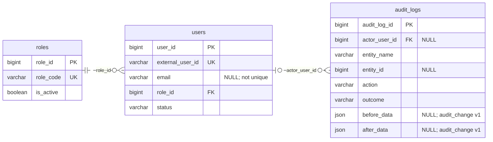
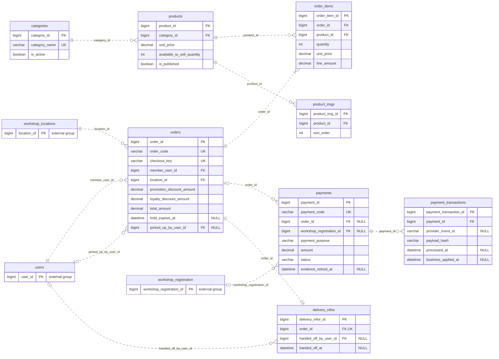
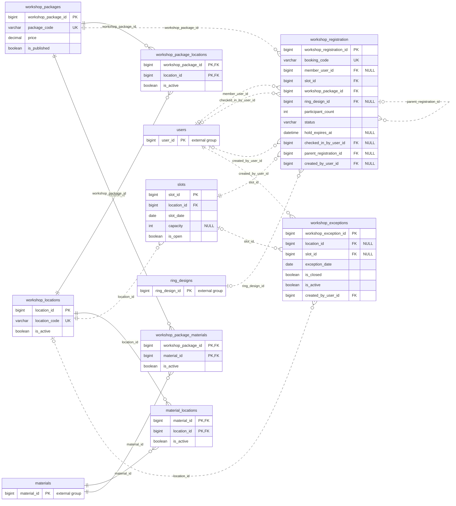
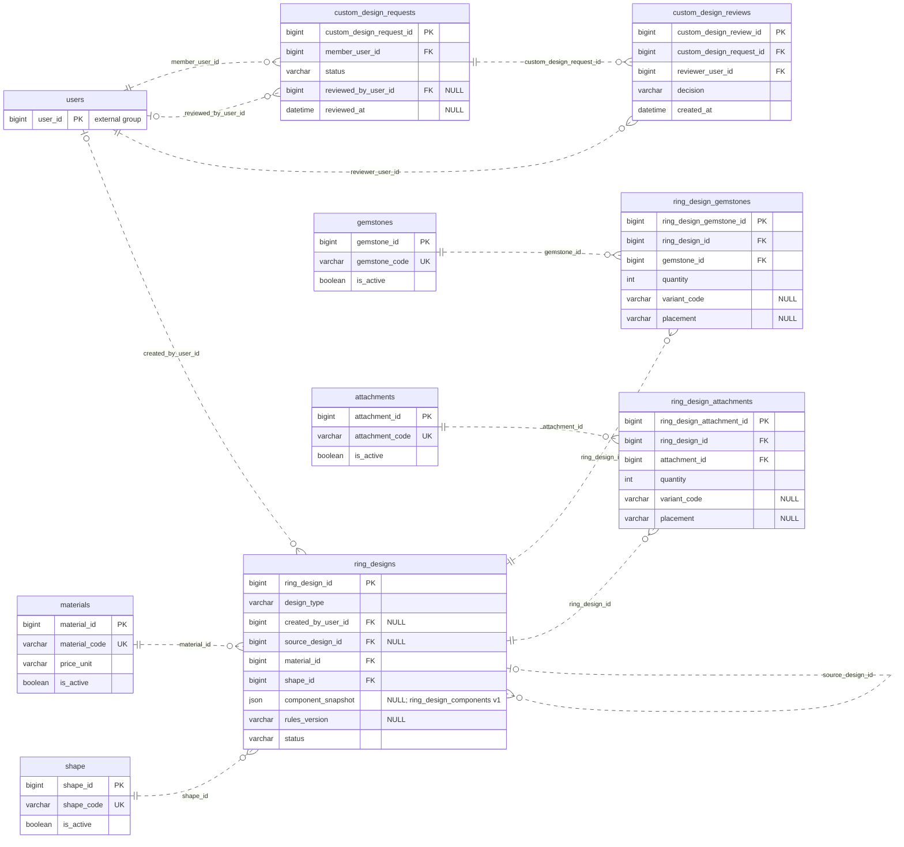
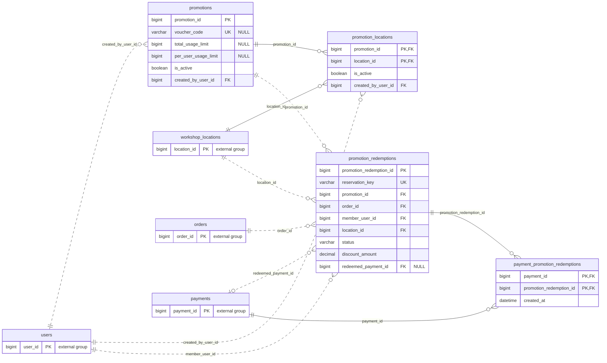
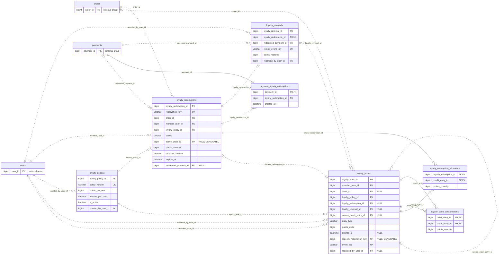

# ERD và mối quan hệ giữa các bảng — PPSWBS

Trạng thái: mô hình quan hệ theo **bản đề xuất hiện tại trong [DB.md](../ppswbs-spec/DB.md)**. Tài liệu gồm **39 bảng logic và 75 FK**, kể cả các mở rộng promotion/loyalty có điều kiện; không khẳng định toàn bộ đã được triển khai trong MySQL. Các quyết định nghiệp vụ còn `TBD` được giữ nguyên.

## 1. Cơ sở đối chiếu và phạm vi

| Nguồn | Vai trò |
| --- | --- |
| [DB.md](../ppswbs-spec/DB.md) | Nguồn chính cho tên bảng/cột, PK, 75 FK ở registry P2.3, nullability, unique và quy tắc P2.2–P2.9. |
| [General Spec](../ppswbs-spec/spec-general.md) và [Authentication Data Model](../ppswbs-spec/features/001-member-authentication/data-model.md) | Bối cảnh Firebase identity, Member entitlement và phân biệt mô hình logic với authentication schema. |
| [Migration V1](../ppswbs_backend/src/main/resources/db/migration/V1__init_member_auth.sql) | Bằng chứng về các khai báo hiện có trong migration; không dùng để thay tên logic của DB.md hoặc khẳng định trạng thái production. |
| [Report 2 — Scope and Purpose](docs/report-2-project-management-plan/sections/02-i-project-overview/01-scope-purpose.md), [Report 3 — Use Cases](docs/report-3-software-requirement-specification/sections/03-i-overall-requirements/04-user-requirements/02-use-cases.md), [Report 1 — Limitations](docs/report-1-project-introduction/sections/07-v-project-scope-limitations/02-limitations-exclusions.md) | Các nguồn nghiệp vụ mà DB.md đối chiếu; khác biệt scope/lifecycle chưa được thống nhất không được tự giải quyết bằng đường nối. |

Sơ đồ được chia theo bảng con sở hữu FK. Một bảng xuất hiện ở nhiều cụm vẫn là cùng một bảng; bản hiển thị `external group` chỉ có PK để đọc cạnh tham chiếu. Mọi FK xuất hiện đúng một lần trong sáu sơ đồ và đúng một dòng ở mục 4.

| Cụm | Bảng thuộc cụm | Số bảng | Số FK |
| --- | --- | --- | --- |
| 1. Tài khoản, vai trò và audit | `users`, `roles`, `audit_logs` | 3 | 2 |
| 2. Sản phẩm, đơn hàng, thanh toán và giao nhận | `categories`, `products`, `product_imgs`, `orders`, `order_items`, `payments`, `payment_transactions`, `delivery_infos` | 8 | 12 |
| 3. Chi nhánh, slot, gói, vật liệu và booking | `workshop_locations`, `slots`, `workshop_packages`, `workshop_registration`, `workshop_exceptions`, `workshop_package_locations`, `material_locations`, `workshop_package_materials` | 8 | 17 |
| 4. Thiết kế nhẫn, component và review ảnh | `materials`, `shape`, `gemstones`, `attachments`, `ring_designs`, `ring_design_gemstones`, `ring_design_attachments`, `custom_design_requests`, `custom_design_reviews` | 9 | 12 |
| 5. Promotion, phạm vi chi nhánh và reservation/redemption | `promotions`, `promotion_locations`, `promotion_redemptions`, `payment_promotion_redemptions` | 4 | 11 |
| 6. Loyalty, credit lot, hold, consumption và reversal | `loyalty_policies`, `loyalty_points`, `loyalty_redemptions`, `loyalty_redemption_allocations`, `payment_loyalty_redemptions`, `loyalty_point_consumptions`, `loyalty_reversals` | 7 | 21 |
| **Tổng, không đếm lặp bảng tham chiếu** | | **39** | **75** |

- Giữ đúng tên hiện tại: `delivery_infos`, `workshop_exceptions`, `workshop_registration` và `shape`. Cột PK của `delivery_infos` vẫn là `delivery_infor_id` như DB.md; ERD không tự đổi tên cột.
- `users.role_id` là FK bắt buộc tới `roles`, **mỗi user một role**. Không có `user_roles` trong inventory và không vẽ quan hệ role N–N.
- `users.external_user_id` là Firebase UID duy nhất; email nullable, không unique, không phải căn cứ tự gộp tài khoản hoặc nối Guest booking.
- Promotion/loyalty là mô hình tương lai/có điều kiện theo DB.md. Vẽ đủ các bảng không đồng nghĩa phê duyệt hay bật feature V1.
- ERD chỉ giữ PK/FK, một số unique đơn và thuộc tính phục vụ đọc quan hệ. Danh sách 446 cột được đặc tả, độ dài, default, CHECK, index và schema JSON đầy đủ vẫn xem DB.md.
- Tài liệu này là Markdown độc lập tại `documents/ERD.md`; không đổi report fragment, manifest, mapping Drive hoặc quy trình xuất bản.

## 2. Cách đọc quan hệ

| Ký hiệu | Ý nghĩa |
| --- | --- |
| `\|\|` | Đúng một bản ghi ở đầu quan hệ đó. |
| `\|o` bên trái / `o\|` bên phải | Không hoặc một bản ghi. |
| `}o` bên trái / `o{` bên phải | Không hoặc nhiều bản ghi. |
| `}\|` bên trái / `\|{` bên phải | Một hoặc nhiều bản ghi. |
| `PK`, `FK`, `UK` | Khóa chính, khóa ngoại, unique đơn hoặc khóa generated unique được ghi rõ. |
| `--` | Quan hệ identifying: trong ERD này FK là một phần PK của bảng con. |
| `..` | Quan hệ non-identifying: FK không nằm trong PK của bảng con; vẫn có thể là FK bắt buộc. |

Quy ước cardinality/đường nối theo [Mermaid ER syntax](https://mermaid.js.org/syntax/entityRelationshipDiagram.html). Nét đứt **không có nghĩa** FK nullable; đọc marker ở hai đầu và chú thích `NULL`. Nét liền/đứt cũng không thể hiện `ON DELETE`.

**Nhãn cạnh là tên FK trong bảng con.** Ví dụ `users |o..o{ workshop_registration : member_user_id`: user có thể có nhiều booking; mỗi booking gắn tối đa một user, có thể để null cho Guest. Các cạnh riêng tới payment target đều nullable, nhưng cả hàng phải thỏa XOR ở mục 6.

Trong bảng quan hệ, **A : B = `1 : 0..N`** nghĩa là mỗi B có đúng một A; mỗi A có thể chưa có B hoặc có nhiều B. `0..1 : 0..N` cho phép B không có A. `1 : 1..N` của order/items là yêu cầu nghiệp vụ tối thiểu một dòng, được service/transaction bảo đảm.

## 3. ERD theo cụm nghiệp vụ

### 3.1. Tài khoản, vai trò và audit

Role và audit đã có liên kết thực: role gán qua users.role_id; audit chỉ có FK actor. entity_name/entity_id là tham chiếu logic đa hình, không vẽ FK tới mọi bảng.

### 3.2. Sản phẩm, đơn hàng, thanh toán và giao nhận

Mỗi order thuộc một Member và một branch xử lý. Payment là attempt; receipt nằm ở payment_transactions. Delivery dùng required unique order FK nên là 1 : 0..1.

### 3.3. Chi nhánh, slot, gói, vật liệu và booking

Booking lấy branch qua slot, không có location_id trực tiếp. Ba bảng compatibility/availability đã có đặc tả; chúng biểu đạt quyền chọn, không phải số lượng tồn kho.

### 3.4. Thiết kế nhẫn, component và review ảnh

Các bảng selection và timeline review đã có đặc tả đầy đủ để vẽ trong mô hình chính. Custom image request vẫn review-only, không nối sang ring_designs/order/booking/payment.

### 3.5. Promotion, phạm vi chi nhánh và reservation/redemption

Campaign scope tách khỏi usage. Reservation/redemption giữ beneficiary/order/branch và thế hệ; payment links cố định thế hệ trước khi gọi provider.

### 3.6. Loyalty, credit lot, hold, consumption và reversal

Ledger, credit lot allocations và consumptions tách biệt. Các vòng tham chiếu phục vụ provenance; không được cascade/delete lịch sử để phá vòng. Cạnh redemption → ledger 0..1 dựa trên CHECK shape và unique generated redeem_redemption_key.

## 4. Mô tả chi tiết mối quan hệ

Mỗi dòng tương ứng một FK được DB.md khai báo; mọi FK dưới đây dùng **`ON DELETE RESTRICT`** theo P2.3. Nullable giữ nghĩa Guest/system/no-target/no-lineage ban đầu, không cho phép xóa cha rồi null FK. Tên constraint cụ thể tra registry P2.3.

### 4.1. Tài khoản, vai trò và audit

| Bảng cha → bảng con | A : B | FK ở bảng con → khóa cha | Ý nghĩa / ràng buộc |
| --- | --- | --- | --- |
| `roles` → `users` | `1 : 0..N` | `users.role_id` → `roles.role_id` | Mỗi tài khoản có đúng một role; một role có nhiều tài khoản. Role phải active khi gán, không có bảng user_roles. |
| `users` → `audit_logs` | `0..1 : 0..N` | `audit_logs.actor_user_id` → `users.user_id` | Actor thực hiện thao tác quản trị; null dành cho system action, không phải xóa actor lịch sử. |

### 4.2. Sản phẩm, đơn hàng, thanh toán và giao nhận

| Bảng cha → bảng con | A : B | FK ở bảng con → khóa cha | Ý nghĩa / ràng buộc |
| --- | --- | --- | --- |
| `categories` → `products` | `1 : 0..N` | `products.category_id` → `categories.category_id` | Mỗi sản phẩm thuộc một danh mục; category có thể chưa có sản phẩm. |
| `users` → `orders` | `1 : 0..N` | `orders.member_user_id` → `users.user_id` | Member mua hàng; Guest không checkout retail. FK không tự xác nhận entitlement. |
| `workshop_locations` → `orders` | `1 : 0..N` | `orders.location_id` → `workshop_locations.location_id` | Chi nhánh xử lý order, được cố định trước khi xét ưu đãi; không suy ra từ địa chỉ giao hàng. |
| `users` → `orders` | `0..1 : 0..N` | `orders.picked_up_by_user_id` → `users.user_id` | Người vận hành ghi nhận pickup, khác người mua; nullable trước pickup. |
| `orders` → `order_items` | `1 : 1..N` | `order_items.order_id` → `orders.order_id` | Order có ít nhất một dòng theo nghiệp vụ; FK riêng lẻ không bảo đảm số dòng tối thiểu. |
| `products` → `order_items` | `1 : 0..N` | `order_items.product_id` → `products.product_id` | Dòng hàng tham chiếu sản phẩm, lưu giá/tên snapshot; unique cặp order/product, không unique riêng product. |
| `products` → `product_imgs` | `1 : 0..N` | `product_imgs.product_id` → `products.product_id` | Một sản phẩm có nhiều ảnh; unique cặp product/sort_order giữ thứ tự. |
| `orders` → `payments` | `0..1 : 0..N` | `payments.order_id` → `orders.order_id` | Target retail của một payment attempt; nullable riêng lẻ nhưng phải thỏa XOR với booking. |
| `workshop_registration` → `payments` | `0..1 : 0..N` | `payments.workshop_registration_id` → `workshop_registration.workshop_registration_id` | Target booking của attempt cọc; nullable riêng lẻ, XOR với order. Guest booking không cần user FK trên payment. |
| `payments` → `payment_transactions` | `1 : 0..N` | `payment_transactions.payment_id` → `payments.payment_id` | Một payment attempt có nhiều callback receipt; receipt không đồng nghĩa đã áp dụng business effect. |
| `orders` → `delivery_infos` | `1 : 0..1` | `delivery_infos.order_id` → `orders.order_id` | FK required + unique: mỗi delivery record thuộc một order, order có tối đa một delivery record. |
| `users` → `delivery_infos` | `0..1 : 0..N` | `delivery_infos.handed_off_by_user_id` → `users.user_id` | Actor bàn giao carrier; nullable trước handoff, bắt buộc ở milestone bàn giao. |

### 4.3. Chi nhánh, slot, gói, vật liệu và booking

| Bảng cha → bảng con | A : B | FK ở bảng con → khóa cha | Ý nghĩa / ràng buộc |
| --- | --- | --- | --- |
| `workshop_packages` → `workshop_package_locations` | `1 : 0..N` | `workshop_package_locations.workshop_package_id` → `workshop_packages.workshop_package_id` | Gói được phép chọn ở các chi nhánh qua link active; FK thuộc PK ghép. |
| `workshop_locations` → `workshop_package_locations` | `1 : 0..N` | `workshop_package_locations.location_id` → `workshop_locations.location_id` | Chi nhánh cung cấp các gói qua link active; không biến package thành inventory. |
| `materials` → `material_locations` | `1 : 0..N` | `material_locations.material_id` → `materials.material_id` | Vật liệu được phép chọn ở các chi nhánh; FK thuộc PK ghép, không ghi số lượng tồn. |
| `workshop_locations` → `material_locations` | `1 : 0..N` | `material_locations.location_id` → `workshop_locations.location_id` | Chi nhánh hỗ trợ vật liệu qua link active; phải kiểm tra cả material/location/link. |
| `users` → `workshop_registration` | `0..1 : 0..N` | `workshop_registration.member_user_id` → `users.user_id` | Member sở hữu booking; null cho Guest, import phải theo luồng xác minh được phép. |
| `slots` → `workshop_registration` | `1 : 0..N` | `workshop_registration.slot_id` → `slots.slot_id` | Booking chọn một slot; slot nhận nhiều nhóm trong giới hạn participant_count/hold. |
| `workshop_packages` → `workshop_registration` | `1 : 0..N` | `workshop_registration.workshop_package_id` → `workshop_packages.workshop_package_id` | Booking chọn một gói; giá/tên/tỷ lệ cọc được snapshot, không lấy lại giá live. |
| `ring_designs` → `workshop_registration` | `0..1 : 0..N` | `workshop_registration.ring_design_id` → `ring_designs.ring_design_id` | Mẫu/configuration được chọn; có thể null khi tư vấn tại chỗ, không trỏ custom image request. |
| `users` → `workshop_registration` | `0..1 : 0..N` | `workshop_registration.checked_in_by_user_id` → `users.user_id` | Actor check-in nhóm; null trước check-in, không đại diện từng participant. |
| `workshop_registration` → `workshop_registration` | `0..1 : 0..N` | `workshop_registration.parent_registration_id` → `workshop_registration.workshop_registration_id` | Booking continuation tham chiếu một booking trước; parent có thể có nhiều continuation; cấm self/cycle. |
| `users` → `workshop_registration` | `0..1 : 0..N` | `workshop_registration.created_by_user_id` → `users.user_id` | Actor tạo booking khi đăng nhập; nullable cho Guest, bắt buộc là Staff được phép ở continuation. |
| `workshop_locations` → `slots` | `1 : 0..N` | `slots.location_id` → `workshop_locations.location_id` | Slot là phiên có ngày tại một chi nhánh; unique location/date/start_time. |
| `workshop_packages` → `workshop_package_materials` | `1 : 0..N` | `workshop_package_materials.workshop_package_id` → `workshop_packages.workshop_package_id` | Compatibility gói/vật liệu; FK thuộc PK ghép, không phải giá override. |
| `materials` → `workshop_package_materials` | `1 : 0..N` | `workshop_package_materials.material_id` → `materials.material_id` | Vật liệu tương thích nhiều gói; retire link bằng is_active, giữ lịch sử. |
| `workshop_locations` → `workshop_exceptions` | `0..1 : 0..N` | `workshop_exceptions.location_id` → `workshop_locations.location_id` | Scope theo chi nhánh; null chỉ trong global/date khi slot cũng null. |
| `slots` → `workshop_exceptions` | `0..1 : 0..N` | `workshop_exceptions.slot_id` → `slots.slot_id` | Scope một dated slot; null cho scope cả ngày, có slot phải có location khớp. |
| `users` → `workshop_exceptions` | `1 : 0..N` | `workshop_exceptions.created_by_user_id` → `users.user_id` | Actor được phép cấu hình ngoại lệ lịch, không phải khách đặt booking. |

### 4.4. Thiết kế nhẫn, component và review ảnh

| Bảng cha → bảng con | A : B | FK ở bảng con → khóa cha | Ý nghĩa / ràng buộc |
| --- | --- | --- | --- |
| `users` → `custom_design_requests` | `1 : 0..N` | `custom_design_requests.member_user_id` → `users.user_id` | Member gửi yêu cầu review-only với mô tả và đúng một ảnh tham chiếu. |
| `users` → `custom_design_requests` | `0..1 : 0..N` | `custom_design_requests.reviewed_by_user_id` → `users.user_id` | Reviewer của quyết định hiện tại; null trước review, khác timeline reviewer ở bảng reviews. |
| `custom_design_requests` → `custom_design_reviews` | `1 : 0..N` | `custom_design_reviews.custom_design_request_id` → `custom_design_requests.custom_design_request_id` | Timeline review append-only; không có unique trên request FK, không suy diễn thành 1–1. |
| `users` → `custom_design_reviews` | `1 : 0..N` | `custom_design_reviews.reviewer_user_id` → `users.user_id` | Actor tạo quyết định review; kiểm tra authority và chống self-review trong use case. |
| `ring_designs` → `ring_design_gemstones` | `1 : 0..N` | `ring_design_gemstones.ring_design_id` → `ring_designs.ring_design_id` | Một design có nhiều selection đá hoặc không có đá; mỗi selection có PK riêng. |
| `gemstones` → `ring_design_gemstones` | `1 : 0..N` | `ring_design_gemstones.gemstone_id` → `gemstones.gemstone_id` | Một catalogue stone dùng trong nhiều selection; quantity dương, variant/placement uniqueness còn TBD. |
| `ring_designs` → `ring_design_attachments` | `1 : 0..N` | `ring_design_attachments.ring_design_id` → `ring_designs.ring_design_id` | Một design có nhiều selection phụ kiện hoặc không có phụ kiện; mỗi selection có PK riêng. |
| `attachments` → `ring_design_attachments` | `1 : 0..N` | `ring_design_attachments.attachment_id` → `attachments.attachment_id` | Một catalogue attachment dùng trong nhiều selection; không mặc định unique cặp design/component. |
| `users` → `ring_designs` | `0..1 : 0..N` | `ring_designs.created_by_user_id` → `users.user_id` | Tác giả catalogue/configuration; null cho Guest được phép, không làm thiết kế công khai. |
| `ring_designs` → `ring_designs` | `0..1 : 0..N` | `ring_designs.source_design_id` → `ring_designs.ring_design_id` | Lineage từ mẫu/phiên bản trước; một nguồn có nhiều bản dẫn xuất; cấm self/cycle. |
| `materials` → `ring_designs` | `1 : 0..N` | `ring_designs.material_id` → `materials.material_id` | Một vật liệu nền cho mỗi design theo đề xuất hiện tại; không tự suy ra đa vật liệu. |
| `shape` → `ring_designs` | `1 : 0..N` | `ring_designs.shape_id` → `shape.shape_id` | Một hình dạng nền; khác gemstone cut, ring size và catalogue model hoàn chỉnh. |

### 4.5. Promotion, phạm vi chi nhánh và reservation/redemption

| Bảng cha → bảng con | A : B | FK ở bảng con → khóa cha | Ý nghĩa / ràng buộc |
| --- | --- | --- | --- |
| `users` → `promotions` | `1 : 0..N` | `promotions.created_by_user_id` → `users.user_id` | Actor tạo campaign; không phải Member sử dụng ưu đãi. |
| `promotions` → `promotion_locations` | `1 : 0..N` | `promotion_locations.promotion_id` → `promotions.promotion_id` | Campaign được bật tại chi nhánh; FK thuộc PK ghép, không có link không nghĩa là global. |
| `workshop_locations` → `promotion_locations` | `1 : 0..N` | `promotion_locations.location_id` → `workshop_locations.location_id` | Chi nhánh có nhiều campaign qua các link active. |
| `users` → `promotion_locations` | `1 : 0..N` | `promotion_locations.created_by_user_id` → `users.user_id` | Actor tạo assignment campaign/chi nhánh; reactivation giữ actor/timestamp gốc. |
| `promotions` → `promotion_redemptions` | `1 : 0..N` | `promotion_redemptions.promotion_id` → `promotions.promotion_id` | Campaign có nhiều thế hệ reservation/redemption; giữ lịch sử released. |
| `orders` → `promotion_redemptions` | `1 : 0..N` | `promotion_redemptions.order_id` → `orders.order_id` | Order áp dụng campaign qua usage record; không thêm promotion_id trực tiếp lên orders. |
| `users` → `promotion_redemptions` | `1 : 0..N` | `promotion_redemptions.member_user_id` → `users.user_id` | Beneficiary phải bằng Member của order; không nhầm với campaign creator. |
| `workshop_locations` → `promotion_redemptions` | `1 : 0..N` | `promotion_redemptions.location_id` → `workshop_locations.location_id` | Branch snapshot phải bằng orders.location_id và đủ điều kiện campaign/location khi reserve. |
| `payments` → `promotion_redemptions` | `0..1 : 0..N` | `promotion_redemptions.redeemed_payment_id` → `payments.payment_id` | Accepted attempt của thế hệ redeemed; null khi reserved/released, phải có exact attempt link. |
| `payments` → `payment_promotion_redemptions` | `1 : 0..N` | `payment_promotion_redemptions.payment_id` → `payments.payment_id` | Link append-only của attempt với các campaign được phép; thành phần PK ghép. |
| `promotion_redemptions` → `payment_promotion_redemptions` | `1 : 0..N` | `payment_promotion_redemptions.promotion_redemption_id` → `promotion_redemptions.promotion_redemption_id` | Một thế hệ còn reserved có thể liên kết nhiều retry attempt; không thay link cũ sang generation mới. |

### 4.6. Loyalty, credit lot, hold, consumption và reversal

| Bảng cha → bảng con | A : B | FK ở bảng con → khóa cha | Ý nghĩa / ràng buộc |
| --- | --- | --- | --- |
| `users` → `loyalty_points` | `1 : 0..N` | `loyalty_points.member_user_id` → `users.user_id` | Member sở hữu bút toán; nhiều bút toán tạo ledger, không phải một dòng số dư. |
| `orders` → `loyalty_points` | `0..1 : 0..N` | `loyalty_points.order_id` → `orders.order_id` | Order gây ra bút toán; sự kiện không gắn order có thể để null. |
| `users` → `loyalty_points` | `0..1 : 0..N` | `loyalty_points.recorded_by_user_id` → `users.user_id` | Actor điều chỉnh thủ công; system posting có thể null. |
| `loyalty_policies` → `loyalty_points` | `1 : 0..N` | `loyalty_points.loyalty_policy_id` → `loyalty_policies.loyalty_policy_id` | Mỗi posting tham chiếu policy version để giữ provenance, kể cả expiry/reversal. |
| `loyalty_redemptions` → `loyalty_points` | `0..1 : 0..1` | `loyalty_points.loyalty_redemption_id` → `loyalty_redemptions.loyalty_redemption_id` | Chỉ redeem debit dùng FK này; CHECK shape + unique generated redeem_redemption_key cho tối đa một debit/redemption. |
| `loyalty_reversals` → `loyalty_points` | `0..1 : 0..N` | `loyalty_points.loyalty_reversal_id` → `loyalty_reversals.loyalty_reversal_id` | Reversal có nhiều credit khôi phục theo lot nguồn; không unique riêng reversal FK. |
| `loyalty_points` → `loyalty_points` | `0..1 : 0..N` | `loyalty_points.source_credit_entry_id` → `loyalty_points.loyalty_point_id` | Self-reference tới credit lot trước cho expiry/reversal; giữ Member/expiry nguồn, cấm self/cycle. |
| `users` → `loyalty_policies` | `1 : 0..N` | `loyalty_policies.created_by_user_id` → `users.user_id` | Actor tạo policy version; không phải người được cộng/redeem điểm. |
| `orders` → `loyalty_redemptions` | `1 : 0..N` | `loyalty_redemptions.order_id` → `orders.order_id` | Order giữ nhiều thế hệ lịch sử; generated unique active_order_id giới hạn một reserved/redeemed generation. |
| `users` → `loyalty_redemptions` | `1 : 0..N` | `loyalty_redemptions.member_user_id` → `users.user_id` | Member giữ/redeem điểm; phải bằng beneficiary của order. |
| `loyalty_policies` → `loyalty_redemptions` | `1 : 0..N` | `loyalty_redemptions.loyalty_policy_id` → `loyalty_policies.loyalty_policy_id` | Policy version xác định conversion/cap/basis; quote sao chép điều khoản, không đoán tỷ lệ quy đổi. |
| `payments` → `loyalty_redemptions` | `0..1 : 0..N` | `loyalty_redemptions.redeemed_payment_id` → `payments.payment_id` | Accepted attempt của loyalty generation; null trước redeem, phải khớp payment link và order. |
| `loyalty_redemptions` → `loyalty_redemption_allocations` | `1 : 0..N` | `loyalty_redemption_allocations.loyalty_redemption_id` → `loyalty_redemptions.loyalty_redemption_id` | Hold generation phân bổ điểm từ nhiều credit lot; thành phần PK ghép. |
| `loyalty_points` → `loyalty_redemption_allocations` | `1 : 0..N` | `loyalty_redemption_allocations.credit_entry_id` → `loyalty_points.loyalty_point_id` | Credit lot dương của cùng Member được giữ tạm; một lot có thể cấp phần cho nhiều hold. |
| `payments` → `payment_loyalty_redemptions` | `1 : 0..1` | `payment_loyalty_redemptions.payment_id` → `payments.payment_id` | payment_id vừa PK vừa FK: mỗi attempt có tối đa một loyalty generation link. |
| `loyalty_redemptions` → `payment_loyalty_redemptions` | `1 : 0..N` | `payment_loyalty_redemptions.loyalty_redemption_id` → `loyalty_redemptions.loyalty_redemption_id` | Một generation còn reserved có thể được dùng bởi nhiều retry attempt hợp lệ. |
| `loyalty_points` → `loyalty_point_consumptions` | `1 : 0..N` | `loyalty_point_consumptions.debit_entry_id` → `loyalty_points.loyalty_point_id` | Bút toán âm tiêu thụ các lot dương; thành phần PK ghép, không phải account balance. |
| `loyalty_points` → `loyalty_point_consumptions` | `1 : 0..N` | `loyalty_point_consumptions.credit_entry_id` → `loyalty_points.loyalty_point_id` | Lot dương nguồn có thể bị tiêu thụ bởi nhiều debit; cùng Member, debit khác credit. |
| `loyalty_redemptions` → `loyalty_reversals` | `1 : 0..1` | `loyalty_reversals.loyalty_redemption_id` → `loyalty_redemptions.loyalty_redemption_id` | Required + unique: một redemption có tối đa một compensation full-refund theo proposal. |
| `payments` → `loyalty_reversals` | `1 : 0..N` | `loyalty_reversals.redeemed_payment_id` → `payments.payment_id` | Attempt đã được hoàn tiền xác minh; phải bằng accepted payment của source redemption. |
| `users` → `loyalty_reversals` | `1 : 0..N` | `loyalty_reversals.recorded_by_user_id` → `users.user_id` | Actor độc lập ghi compensation có bằng chứng; partial-refund policy vẫn TBD. |

## 5. Quan hệ N–N, khóa ghép và unique có điều kiện

Không vẽ thêm cạnh N–N trực tiếp bên cạnh hai FK của bảng nối. Các quan hệ bên dưới đã được biểu diễn bằng bảng trung gian trong mục 3–4.

| Hai phía | Bảng nối / usage | Khóa và ý nghĩa |
| --- | --- | --- |
| `orders` ↔ `products` | `order_items` | PK surrogate `order_item_id`; unique `(order_id, product_id)`. Có quantity và giá/tên snapshot. |
| `workshop_packages` ↔ `workshop_locations` | `workshop_package_locations` | PK ghép `(workshop_package_id, location_id)`; `is_active` điều khiển quyền chọn gói tại branch. |
| `materials` ↔ `workshop_locations` | `material_locations` | PK ghép `(material_id, location_id)`; availability, không phải inventory. |
| `workshop_packages` ↔ `materials` | `workshop_package_materials` | PK ghép `(workshop_package_id, material_id)`; compatibility, không phải giá override. |
| `ring_designs` ↔ `gemstones` | `ring_design_gemstones` | PK surrogate `ring_design_gemstone_id`; quantity dương. Không tự đặt unique design/stone khi variant/placement còn TBD. |
| `ring_designs` ↔ `attachments` | `ring_design_attachments` | PK surrogate `ring_design_attachment_id`; quantity dương, variant/placement giữ theo source. |
| `promotions` ↔ `workshop_locations` | `promotion_locations` | PK ghép `(promotion_id, location_id)`; actor tạo link và flag active được giữ. |
| `orders` ↔ `promotions` | `promotion_redemptions` | PK surrogate theo generation; không phải unique tuyệt đối order/promotion vì giữ nhiều released generation. |
| `payments` ↔ `promotion_redemptions` | `payment_promotion_redemptions` | PK ghép `(payment_id, promotion_redemption_id)`. Nhiều attempt có thể tham chiếu một generation; nhiều campaign/attempt chỉ khi stacking được phê duyệt. |
| `loyalty_redemptions` ↔ credit `loyalty_points` | `loyalty_redemption_allocations` | PK ghép `(loyalty_redemption_id, credit_entry_id)`; quantity giữ tạm từ từng lot. |
| Debit `loyalty_points` ↔ credit `loyalty_points` | `loyalty_point_consumptions` | PK ghép `(debit_entry_id, credit_entry_id)`; phân bổ lượng tiêu thụ của debit vào lot nguồn. |

`payment_loyalty_redemptions` là **link có ràng buộc riêng**, không phải N–N không giới hạn: `payment_id` vừa PK vừa FK nên mỗi attempt liên kết tối đa một loyalty generation; một generation có thể có nhiều attempt.

| Ràng buộc | Ảnh hưởng lên cardinality / lịch sử |
| --- | --- |
| `delivery_infos.order_id` required + unique | Order có tối đa một delivery record; không tự bảo đảm carrier milestone hay dữ liệu recipient đầy đủ. |
| `loyalty_reversals.loyalty_redemption_id` required + unique | Redemption có tối đa một full-refund reversal theo proposal; không cho suy ra partial-refund policy. |
| `loyalty_points.redeem_redemption_key` generated + unique và CHECK entry shape | Chỉ redeem debit gắn redemption; tối đa một debit/redemption. Cạnh 0..1 ở sơ đồ loyalty phụ thuộc đồng thời hai ràng buộc này, không chỉ một FK nullable. |
| `loyalty_redemptions.active_order_id` generated + unique | Tối đa một reserved/redeemed generation/order; vẫn có nhiều released generation. Quan hệ order/history vẫn 1–N. |
| Unique `(promotion_id, active_order_id)` | Tối đa một reserved/redeemed generation/order/campaign; không cấm nhiều campaign khác nhau nếu policy cho phép. |
| Unique `(loyalty_reversal_id, source_credit_entry_id)` | Một reversal khôi phục mỗi lot nguồn tối đa một lần, nhưng có thể khôi phục nhiều lot. |
| Unique callback `(provider, provider_event_id)`, fingerprint `(provider, payment_id, payload_hash)` | Deduplicate trusted receipts; không đổi quan hệ payment/receipt thành 1–1. Provider event ID có thể null. |
| Unique `(order_id, product_id)`, `(product_id, sort_order)`, `(location_id, slot_date, start_time)` | Unique ghép, không đánh dấu từng cột đơn lẻ bằng UK trong sơ đồ. |

`active_order_id`, `active_currency` và `redeem_redemption_key` là generated keys cho enforcement, **không phải FK mới**. Các ID bên trong JSON hoặc audit composite-scope profile cũng không tự tạo FK.

## 6. Quy tắc không thể thể hiện chỉ bằng đường nối

| Nhóm | Quy tắc cần bảo đảm theo DB.md |
| --- | --- |
| Single role — P2.4 | FK/index trên role_id; không gán role inactive. Không deactivate role khi còn bất kỳ user tham chiếu, kể cả suspended; phải reassign hợp lệ và dùng shared role/user locks + audit. Role label không tự cấp quyền. |
| Payment target — XOR | Chính xác một trong order_id/workshop_registration_id khác null, khớp payment_purpose. Cấm cả hai null hoặc cùng có giá trị. Không nối payment trực tiếp tới users để ép Guest thành Member. |
| Attempt, receipt và idempotency — P2.8 | T-PAYMENT phải khớp target, amount, currency, generation, deadline và authority hiện tại; business effect chỉ áp dụng một lần. T-RECEIPT lưu receipt/work trước, business application trong transaction riêng. Redirect không phải bằng chứng thanh toán. |
| Order/items và số lượng — P2.8 | Order phải có ít nhất một item, tạo đủ order/items/discount snapshots/hold/work/audit cùng transaction. Q là remaining-unsold quantity; reservation tính cùng hold hợp lệ, payment trừ Q đúng một lần, release unpaid hold không cộng Q lần nữa. |
| Delivery và pickup | Carrier record gắn order đã paid và chọn carrier; handoff cần carrier/reference/actor/time. Pickup actor khác Member mua hàng. Nullable trước milestone không làm các dữ liệu đó tùy chọn khi hoàn tất. |
| Group capacity / branch availability | Seat demand là tổng participant_count của booking/hold đủ điều kiện, không phải số dòng booking. Branch suy ra qua slot; đồng thời kiểm tra published package, active location/material và các link compatibility/availability. Không suy diễn inventory/component stock từ các link. |
| Exception scope | Global/date: location/slot cùng null. Location/date: có location, slot null. Slot scope: có cả hai và khớp slot/date. Naive unique với nullable scope không đủ; precedence/capacity/time overlap vẫn theo policy chưa chốt. |
| Self-reference | parent_registration_id, source_design_id và source_credit_entry_id không self/cycle; lot nguồn phải đúng Member/sign/expiry. Parent booking không tự tạo custody, giữ slot sau hoặc tái dùng cọc. |
| Custom review — P2.8 | Review row và current request status/reviewer/time/reason commit cùng transaction; kiểm tra reviewer độc lập, chống self-review và competing terminal review. Accepted không tự tạo design, quote, booking, order hay payment. |
| Promotion — P2.5 | Beneficiary/branch bằng order, còn campaign/location eligibility và quota khi reserve. Không thay generation link của attempt cũ. Payment failure/expiry release theo current-state guards, giữ row lịch sử; callback cũ không tiêu thụ generation mới. |
| Loyalty — P2.6 | Ledger postings immutable; credit lots có expiry, allocations giữ tạm, consumptions ghi tiêu thụ thật. Conversion lấy từ approved versioned policy và snapshot. Refund reversal cần bằng chứng; khôi phục lot với expiry gốc, không tự gia hạn hay chốt partial refund. |
| Snapshots / JSON — P2.9 | Order/booking/design frozen giữ giá trị lịch sử. Component dùng ring_design_components/1; audit before/after dùng audit_change/1 với schema_name/schema_version/data, closed profile, byte/depth bounds và backward-compatible readers. JSON không thay relational FK, rule store hoặc source-state validation. |
| Authorization / audit | FK chỉ chứng minh bản ghi được tham chiếu tồn tại. Use case kiểm tra role/status/entitlement/self-benefit. Audit actor là FK; entity_name/entity_id là logical scope. Payment timeline ở payment_transactions, review timeline ở custom_design_reviews, không dồn mọi lịch sử vào audit_logs. |
| Delete behavior — P2.3 | Cả 75 FK dùng ON DELETE RESTRICT; không CASCADE/SET NULL. Unpublish/deactivate/archive theo domain; không thêm universal deleted_at. FK không ngăn xóa leaf rows, nên lịch sử phải được bảo vệ cả ở service/access policy. |
| Retention — P2.7 | Audit/payment evidence theo retention/hold/access/expiry đã nêu ở P2.7; raw callback/token/card data không được lưu. Archive phải giữ identity/FK/idempotency lookup và schema reader. Chưa có bảng archive riêng; không vô hiệu FK hoặc null parent để purge. |
| Audit transaction — P2.8 | Successful audit cùng business action; audit lỗi thì rollback business. Rejection/failure evidence theo survival rules, không ghi proposed values thành committed after-image. External provider/email work nằm sau commit với durable retry. |
| Future scope | ERD cho thấy cấu trúc cần có, không bật promotion/loyalty/refund hay tự ratify scope. Mọi thay đổi schema cần approved mapping, versioned migration và kiểm thử của feature. |

## 7. Khác biệt physical schema và các phần còn TBD

| Vấn đề | Trạng thái / giới hạn |
| --- | --- |
| Logical ↔ physical mapping | Migration V1 khai báo members, policy_documents, member_policy_acceptances, member_auth_audit_events, workshop_bookings và booking_email_confirmations. Ánh xạ users/workshop_registration và các extension sang physical tables vẫn cần approved feature plan; 39 bảng ở đây không phải inventory production. |
| Email confirmation / policy | V1 có workshop_bookings.member_id nullable; booking_email_confirmations.booking_id required + unique và FK tới booking. Acceptance tham chiếu member/policy. Các bảng này thuộc physical authentication model, không tự thêm vào 39 bảng hoặc đoán FK tới workshop_registration. |
| Existing audit text | V1 member_auth_audit_events.member_id không khai báo FK. safe_metadata text hiện có không đồng nghĩa các audit_change/1 JSON contracts đã được triển khai. Giữ physical/logical mapping riêng. |
| Role codes / permissions | Working agreement có MEMBER/STAFF/OWNER/ADMIN_TECHNICAL; Report 3 có tên Manager/Admin. Reconciliation còn TBD, nhưng ERD hiện đã chốt cấu trúc một role/user theo DB.md. |
| Hold / late payment | hold_expires_at và transaction/generation guards đã được đặc tả; các xung đột lifecycle nguồn, thời lượng policy cuối cùng và cách xử lý late-success còn phụ thuộc P2.10/feature plan. ERD không chọn policy từ hình vẽ. |
| Promotion stacking / loyalty conversion | Usage, reservation, policy và order discount snapshots đã có; không còn thiếu bảng như ERD trước. Actual stacking, finite caps, conversion values và rounding/tax policy vẫn cần phê duyệt. |
| Package/material pricing | Package-material/location links đã có. Giá theo nhóm, unit conversion, material weight, labour, cọc package/material và precedence không được suy ra từ PK/FK. |
| Design / component vocabulary | Component selections có PK/FK/quantity; variant/placement uniqueness, ring-size taxonomy, compatibility/rule backing store và detailed status transitions còn TBD. JSON schema version không thay rules_version. |
| Design → retail | DB.md không có FK design → product/order_item; không vẽ cạnh suy đoán. Thiết kế riêng cho từng participant trong booking nhóm cần mô hình riêng. |
| Custom image scope | Giữ review-only boundary theo DB.md; image/AI/quote workflow rộng hơn cần quyết định riêng. Không tạo đường nối chỉ vì cùng có từ design. |
| Booking billing/custody | Invoice, adjustment, consent, settlement, participant-level attendance và custody chưa có bảng trong DB.md; check-in/continuation không thay thế các mô hình đó. |
| Physical archive / enforcement | P2.7/P2.9 đã có contract retention/JSON; migration mapping, archive infrastructure, decoder resources, actual MySQL checks và concurrency verification là bước triển khai riêng. Không đánh dấu tất cả retention/schema rules là TBD trở lại. |

## 8. Tiêu chí đối chiếu tài liệu

- Sáu ERD có tổng cộng 39 bảng phân biệt và 75 cạnh FK, không thêm bảng hoặc cạnh chưa được DB.md khai báo.
- Mục 4 có đúng 75 dòng, mỗi dòng khớp child column, parent key và nullability ở DB.md; PK ghép/unique ảnh hưởng cardinality được nêu riêng ở mục 5.
- FK required và nullable được phân biệt; Guest/system/self-reference giữ đúng nghĩa. Composite unique không bị trình bày thành unique từng cột.
- Các CHECK, transaction, retention, JSON và policy constraints được giải thích ngoài sơ đồ; không suy diễn chúng từ crow's-foot.
- Tài liệu mô tả thiết kế đề xuất; enforcement/runtime schema phải được xác nhận bằng migration và kiểm thử riêng.
