# Mland system ERD

Status: proposed logical data model

This document describes the relational model for the current requirements baseline. It is intentionally provider-neutral for authentication and keeps carrier tracking, full logistics exception handling and Google review import as extensions around the V1 transaction core.

## Scope and design rules

- Database target: MySQL.
- Application target: Spring Boot, Java 21, JPA and Flyway.
- `APP_USER.USER_ID` is the application identity key. An external identity provider is linked through `EXTERNAL_IDENTITY`; Cognito/Auth0/Firebase/Keycloak values are never business keys.
- Guests may own a booking through `BOOKING_CONTACT` without an `APP_USER`.
- Money is represented by `DECIMAL` values plus an ISO currency code. Invoice lines retain price snapshots.
- All mutable business records should have `created_at`, `updated_at` and an explicit status where a lifecycle exists.
- JSON columns are limited to provider payloads, before/after audit snapshots and extensible metadata. They are not used for core relationships.
- Logical ownership follows the V1 modular-monolith convention: Member identity/authorization belongs to `members`; booking/capacity to `workshopbooking`; catalogue definitions/prices to `catalogue`; feasibility to `designreview`; invoices/consent/settlement to `billing`; gateway transactions to `payments`; ready-ring reservation/sales to `readyringsales`; custody/handoff to `fulfilment`; and check-in workflows to `operations`. This naming does not alter the proposed logical schema.

## Logical ERD

```mermaid
erDiagram
    APP_USER ||--o{ EXTERNAL_IDENTITY : has
    APP_USER ||--o{ USER_ROLE : receives
    ROLE ||--o{ USER_ROLE : grants
    APP_USER ||--o| STAFF_PROFILE : has
    BRANCH ||--o{ STAFF_PROFILE : home_branch

    BRANCH ||--o{ WORKSHOP_SESSION : hosts
    WORKSHOP_SESSION_TEMPLATE ||--o{ WORKSHOP_SESSION : instantiates
    WORKSHOP_SESSION ||--|| SESSION_CAPACITY : configures
    BRANCH ||--o{ STAFF_SHIFT : schedules
    STAFF_SHIFT ||--o{ SHIFT_ASSIGNMENT : has
    STAFF_PROFILE ||--o{ SHIFT_ASSIGNMENT : works

    CATALOG_PACKAGE ||--o{ CATALOG_PRICE : priced_as
    CATALOG_COMPONENT ||--o{ CATALOG_COMPONENT_OPTION : offers
    DESIGN_REQUEST ||--o{ DESIGN_COMPONENT_SELECTION : contains
    CATALOG_COMPONENT_OPTION ||--o{ DESIGN_COMPONENT_SELECTION : selected
    DESIGN_REQUEST ||--o{ DESIGN_REFERENCE_ASSET : references
    DESIGN_REQUEST ||--o{ DESIGN_FEATURE_CANDIDATE : analyses
    DESIGN_REQUEST ||--o{ FEASIBILITY_REVIEW : reviewed_by
    APP_USER ||--o{ FEASIBILITY_REVIEW : acts
    READY_RING_PRODUCT ||--o{ READY_RING_UNIT : stocked_as

    APP_USER ||--o{ BOOKING : member_booking
    BRANCH ||--o{ BOOKING : selected
    WORKSHOP_SESSION ||--o{ BOOKING : reserves
    CATALOG_PACKAGE ||--o{ BOOKING : package
    BOOKING ||--|| BOOKING_CONTACT : contact
    BOOKING ||--o{ BOOKING_PARTICIPANT : includes
    BOOKING ||--o| BOOKING_CODE : tracked_by
    BOOKING ||--o| BOOKING_DESIGN_LINK : uses
    DESIGN_REQUEST ||--o{ BOOKING_DESIGN_LINK : attached

    BOOKING ||--|| INVOICE : billed_by
    RETAIL_ORDER ||--|| INVOICE : billed_by
    INVOICE ||--o{ INVOICE_LINE : contains
    INVOICE ||--o{ INVOICE_ADJUSTMENT : adjusted_by
    INVOICE_ADJUSTMENT ||--o| ADJUSTMENT_CONSENT : consented
    INVOICE ||--o{ PAYMENT_INTENT : requests
    PAYMENT_INTENT ||--o{ PAYMENT_TRANSACTION : attempts
    PAYMENT_TRANSACTION ||--o{ PAYMENT_EVENT : receives
    INVOICE ||--o{ SETTLEMENT : settled_by
    APP_USER ||--o{ INVOICE_ADJUSTMENT : records
    APP_USER ||--o{ SETTLEMENT : records

    APP_USER ||--o{ RETAIL_ORDER : places
    RETAIL_ORDER ||--o{ RETAIL_ORDER_ITEM : contains
    READY_RING_PRODUCT ||--o{ RETAIL_ORDER_ITEM : ordered
    RETAIL_ORDER_ITEM ||--o| INVENTORY_RESERVATION : reserves
    READY_RING_UNIT ||--o{ INVENTORY_RESERVATION : allocated
    RETAIL_ORDER ||--o| FULFILLMENT : fulfills
    FULFILLMENT ||--o| CARRIER_HANDOFF : handed_to
    CARRIER ||--o{ CARRIER_HANDOFF : performs
    APP_USER ||--o{ CARRIER_HANDOFF : records

    BOOKING ||--o| BOOKING_CHECK_IN : checks_in
    BOOKING ||--o{ WORK_ITEM : produces
    WORK_ITEM ||--o{ CONTINUATION_BOOKING : continues
    BOOKING ||--o{ CONTINUATION_BOOKING : links
    WORKSHOP_SESSION ||--o{ CONTINUATION_BOOKING : scheduled
    WORK_ITEM ||--o{ CUSTODY_EVENT : custody
    APP_USER ||--o{ BOOKING_CHECK_IN : records
    APP_USER ||--o{ CUSTODY_EVENT : records

    APP_USER ||--o{ AUDIT_EVENT : acts
    TECHNICAL_INTEGRATION ||--o{ INTEGRATION_REQUEST : receives
    OUTBOX_EVENT ||--o{ NOTIFICATION_DELIVERY : dispatches

    REVIEW_IMPORT_RUN ||--o{ EXTERNAL_REVIEW : imports
    EXTERNAL_REVIEW ||--o| REVIEW_VISIBILITY : controls
    APP_USER ||--o{ REVIEW_IMPORT_RUN : requests
    APP_USER ||--o{ REVIEW_VISIBILITY : approves

    APP_USER {
        bigint user_id PK
        string email
        string status
        string locale
        datetime created_at
    }
    EXTERNAL_IDENTITY {
        bigint external_identity_id PK
        bigint user_id FK
        string provider
        string subject
        string email_snapshot
        datetime linked_at
    }
    ROLE {
        bigint role_id PK
        string code UK
    }
    USER_ROLE {
        bigint user_id PK, FK
        bigint role_id PK, FK
        bigint assigned_by FK
        datetime assigned_at
    }
    STAFF_PROFILE {
        bigint staff_profile_id PK
        bigint user_id FK
        bigint home_branch_id FK
        string display_name
        string status
    }
    BRANCH {
        bigint branch_id PK
        string code UK
        string name
        string timezone
        string status
    }
    WORKSHOP_SESSION_TEMPLATE {
        bigint template_id PK
        string code UK
        time start_time
        time end_time
    }
    WORKSHOP_SESSION {
        bigint session_id PK
        bigint branch_id FK
        bigint template_id FK
        date service_date
        string status
    }
    SESSION_CAPACITY {
        bigint session_id PK, FK
        int capacity
        int booked_count
        datetime updated_at
    }
    STAFF_SHIFT {
        bigint shift_id PK
        bigint branch_id FK
        datetime starts_at
        datetime ends_at
        string status
    }
    SHIFT_ASSIGNMENT {
        bigint shift_id PK, FK
        bigint staff_profile_id PK, FK
        datetime assigned_at
    }
    CATALOG_PACKAGE {
        bigint package_id PK
        string code UK
        string name
        string status
    }
    CATALOG_PRICE {
        bigint catalog_price_id PK
        bigint package_id FK
        decimal amount
        string currency
        datetime valid_from
        datetime valid_to
    }
    CATALOG_COMPONENT {
        bigint component_id PK
        string code UK
        string name
        string status
    }
    CATALOG_COMPONENT_OPTION {
        bigint option_id PK
        bigint component_id FK
        string code
        json metadata_json
    }
    READY_RING_PRODUCT {
        bigint product_id PK
        string sku UK
        string name
        decimal price
        string currency
        string status
    }
    READY_RING_UNIT {
        bigint unit_id PK
        bigint product_id FK
        string serial_or_lot
        string status
    }
    DESIGN_REQUEST {
        bigint design_request_id PK
        string route
        string status
        datetime consent_at
    }
    DESIGN_COMPONENT_SELECTION {
        bigint design_request_id PK, FK
        bigint option_id PK, FK
        int quantity
    }
    DESIGN_REFERENCE_ASSET {
        bigint asset_id PK
        bigint design_request_id FK
        string object_key
        datetime retention_until
        string consent_text_version
    }
    DESIGN_FEATURE_CANDIDATE {
        bigint candidate_id PK
        bigint design_request_id FK
        string source
        json payload_json
    }
    FEASIBILITY_REVIEW {
        bigint review_id PK
        bigint design_request_id FK
        bigint reviewer_user_id FK
        string decision
        string reason
        datetime reviewed_at
    }
    BOOKING {
        bigint booking_id PK
        bigint member_user_id FK
        bigint branch_id FK
        bigint session_id FK
        bigint package_id FK
        string status
        string guest_lookup_token_hash
    }
    BOOKING_CONTACT {
        bigint booking_id PK, FK
        string name
        string email
        string phone
        string country_code
    }
    BOOKING_PARTICIPANT {
        bigint participant_id PK
        bigint booking_id FK
        string name
        string status
    }
    BOOKING_CODE {
        bigint booking_id PK, FK
        string code_hash
        string qr_payload_hash
        datetime issued_at
    }
    BOOKING_DESIGN_LINK {
        bigint booking_id PK, FK
        bigint design_request_id FK
    }
    INVOICE {
        bigint invoice_id PK
        bigint booking_id FK
        bigint retail_order_id FK
        string status
        string currency
        decimal total_amount
        decimal deposit_due
    }
    INVOICE_LINE {
        bigint invoice_line_id PK
        bigint invoice_id FK
        string description_snapshot
        decimal unit_price
        int quantity
        decimal line_total
    }
    INVOICE_ADJUSTMENT {
        bigint adjustment_id PK
        bigint invoice_id FK
        bigint actor_user_id FK
        decimal amount
        string reason
        datetime created_at
    }
    ADJUSTMENT_CONSENT {
        bigint consent_id PK
        bigint adjustment_id FK
        string consented_by
        datetime consented_at
        string wording_version
    }
    PAYMENT_INTENT {
        bigint payment_intent_id PK
        bigint invoice_id FK
        string purpose
        decimal amount
        string currency
        string status
    }
    PAYMENT_TRANSACTION {
        bigint transaction_id PK
        bigint payment_intent_id FK
        string provider
        string provider_transaction_id
        string status
        datetime confirmed_at
    }
    PAYMENT_EVENT {
        bigint payment_event_id PK
        bigint transaction_id FK
        string provider_event_id UK
        string event_type
        boolean signature_verified
        json payload_json
    }
    SETTLEMENT {
        bigint settlement_id PK
        bigint invoice_id FK
        bigint recorded_by FK
        string method
        decimal amount
        datetime recorded_at
    }
    RETAIL_ORDER {
        bigint order_id PK
        bigint member_user_id FK
        string status
        string currency
        decimal total_amount
    }
    RETAIL_ORDER_ITEM {
        bigint order_item_id PK
        bigint order_id FK
        bigint product_id FK
        int quantity
        decimal unit_price_snapshot
    }
    INVENTORY_RESERVATION {
        bigint reservation_id PK
        bigint order_item_id FK
        bigint unit_id FK
        string status
        datetime reserved_at
    }
    FULFILLMENT {
        bigint fulfillment_id PK
        bigint order_id FK
        string method
        string status
        json destination_json
    }
    CARRIER {
        bigint carrier_id PK
        string code UK
        string name
        string adapter_key
        string status
    }
    CARRIER_HANDOFF {
        bigint handoff_id PK
        bigint fulfillment_id FK
        bigint carrier_id FK
        bigint recorded_by FK
        string tracking_reference
        datetime handed_at
    }
    BOOKING_CHECK_IN {
        bigint check_in_id PK
        bigint booking_id FK
        bigint recorded_by FK
        int actual_participants
        datetime checked_in_at
    }
    WORK_ITEM {
        bigint work_item_id PK
        bigint booking_id FK
        string description
        string status
    }
    CONTINUATION_BOOKING {
        bigint continuation_id PK
        bigint work_item_id FK
        bigint source_booking_id FK
        bigint booking_id FK
        bigint created_by FK
    }
    CUSTODY_EVENT {
        bigint custody_event_id PK
        bigint work_item_id FK
        string event_type
        string location
        bigint actor_user_id FK
        datetime occurred_at
    }
    AUDIT_EVENT {
        bigint audit_event_id PK
        bigint actor_user_id FK
        string actor_type
        string action
        string entity_type
        string entity_id
        string reason
        json before_json
        json after_json
        string correlation_id
        datetime created_at
    }
    TECHNICAL_INTEGRATION {
        bigint integration_id PK
        string kind
        string provider
        string status
        string configuration_ref
    }
    INTEGRATION_REQUEST {
        bigint request_id PK
        bigint integration_id FK
        string operation
        string idempotency_key
        string status
        json request_meta_json
        json response_meta_json
    }
    OUTBOX_EVENT {
        bigint outbox_event_id PK
        string event_type
        string aggregate_type
        string aggregate_id
        json payload_json
        datetime published_at
    }
    NOTIFICATION_DELIVERY {
        bigint delivery_id PK
        bigint outbox_event_id FK
        string channel
        string provider_message_id
        string status
        int attempt_count
    }
    REVIEW_IMPORT_RUN {
        bigint run_id PK
        string provider
        bigint requested_by FK
        string status
        datetime started_at
        datetime finished_at
    }
    EXTERNAL_REVIEW {
        bigint external_review_id PK
        bigint run_id FK
        string provider_review_id UK
        int rating
        string comment
        string reviewer_name_snapshot
        datetime published_at
    }
    REVIEW_VISIBILITY {
        bigint external_review_id PK, FK
        string visibility
        bigint approved_by FK
        datetime approved_at
        string reason
    }
```

## Entity dictionary

### Identity and organization

| Table | Key fields | Purpose and constraints |
|---|---|---|
| `app_user` | `user_id PK`, `email`, `status` | Application identity. Email is unique only under the chosen account policy; it is not the business primary key. |
| `external_identity` | `external_identity_id PK`, `user_id FK`, `provider`, `subject` | Maps a Cognito/Auth0/etc. subject to one app user. Unique `(provider, subject)`. |
| `role` | `role_id PK`, `code` | `MEMBER`, `STAFF`, `OWNER`, `ADMIN_TECHNICAL`. |
| `user_role` | `(user_id, role_id) PK` | Many-to-many role assignment. Add `assigned_by` and `assigned_at` for governance. |
| `staff_profile` | `staff_profile_id PK`, `user_id FK`, `home_branch_id FK` | Staff-specific profile. A staff member can work other branches through shift assignments. |
| `branch` | `branch_id PK`, `code UK`, `name`, `timezone`, `status` | Physical workshop location and operational timezone. |

### Branch, workshop and shifts

| Table | Key fields | Purpose and constraints |
|---|---|---|
| `workshop_session_template` | `template_id PK`, `code UK`, `start_time`, `end_time` | Reusable session definition; baseline includes three daily sessions. |
| `workshop_session` | `session_id PK`, `branch_id FK`, `template_id FK`, `service_date`, `status` | Bookable occurrence. Unique `(branch_id, service_date, template_id)`. |
| `session_capacity` | `session_id PK/FK`, `capacity`, `booked_count` | Capacity configuration for a session. `booked_count` is derived or maintained transactionally, never trusted without reconciliation. |
| `staff_shift` | `shift_id PK`, `branch_id FK`, `starts_at`, `ends_at`, `status` | Operational shift; does not itself grant permissions. |
| `shift_assignment` | `shift_id FK`, `staff_profile_id FK`, composite PK | Staff-to-shift assignment. Prevent overlapping assignments in application validation. |

### Catalogue and design

| Table | Key fields | Purpose and constraints |
|---|---|---|
| `catalog_package` | `package_id PK`, `code UK`, `name`, `status` | Workshop package or sellable package definition. |
| `catalog_price` | `catalog_price_id PK`, `package_id FK`, `amount`, `currency`, `valid_from`, `valid_to` | Versioned price. No overlapping active periods for one package/currency. |
| `catalog_component` | `component_id PK`, `code UK`, `name`, `status` | Owner-confirmed design component family. |
| `catalog_component_option` | `option_id PK`, `component_id FK`, `code`, `metadata_json` | Selectable option within a component. |
| `ready_ring_product` | `product_id PK`, `sku UK`, `name`, `price`, `currency`, `status` | Customer-facing ready-ring product. |
| `ready_ring_unit` | `unit_id PK`, `product_id FK`, `serial_or_lot`, `status` | Physical unit. Unique `(product_id, serial_or_lot)` when the identifier exists. |
| `design_request` | `design_request_id PK`, `route`, `status`, `consent_at` | Approved model, configured design or reference-image request. |
| `design_component_selection` | `design_request_id FK`, `option_id FK`, composite PK | Components selected for a design request. |
| `design_reference_asset` | `asset_id PK`, `design_request_id FK`, `object_key`, `retention_until`, `consent_text_version` | Consent-bound image metadata; binary content belongs in object storage. |
| `design_feature_candidate` | `candidate_id PK`, `design_request_id FK`, `source`, `payload_json` | AI-returned candidate features only. It cannot set final price or feasibility. |
| `feasibility_review` | `review_id PK`, `design_request_id FK`, `reviewer_user_id FK`, `decision`, `reason` | Auto, Staff or Owner feasibility decision with an audit context. |

### Booking and tracking

| Table | Key fields | Purpose and constraints |
|---|---|---|
| `booking` | `booking_id PK`, `member_user_id FK NULL`, `branch_id FK`, `session_id FK`, `status`, `guest_lookup_token_hash` | Guest or Member workshop booking. `member_user_id` is nullable. |
| `booking_contact` | `booking_id PK/FK`, `name`, `email`, `phone`, `country_code` | Contact snapshot used for booking and Guest lookup. |
| `booking_participant` | `participant_id PK`, `booking_id FK`, `name`, `status` | People participating in the booking; supports check-in and extra participant adjustments. |
| `booking_code` | `booking_id PK/FK`, `code_hash`, `qr_payload_hash`, `issued_at` | Protected booking lookup/QR representation. |
| `booking_design_link` | `booking_id PK/FK`, `design_request_id FK` | Optional design request attached to a booking. Unique `booking_id` for the current one-design-per-booking assumption. |

### Invoice and payment

| Table | Key fields | Purpose and constraints |
|---|---|---|
| `invoice` | `invoice_id PK`, `booking_id FK NULL`, `retail_order_id FK NULL`, `status`, `currency`, `total_amount`, `deposit_due` | One invoice belongs to either a workshop booking or retail order. Enforce exactly one owner at application/database level. |
| `invoice_line` | `invoice_line_id PK`, `invoice_id FK`, `description_snapshot`, `unit_price`, `quantity`, `line_total` | Immutable price snapshot. |
| `invoice_adjustment` | `adjustment_id PK`, `invoice_id FK`, `actor_user_id FK`, `amount`, `reason`, `created_at` | Append-only adjustment audit trail. |
| `adjustment_consent` | `consent_id PK`, `adjustment_id FK`, `consented_by`, `consented_at`, `wording_version` | Customer consent for adjustments where required. |
| `payment_intent` | `payment_intent_id PK`, `invoice_id FK`, `purpose`, `amount`, `currency`, `status` | Deposit, retail full payment or final settlement request. |
| `payment_transaction` | `transaction_id PK`, `payment_intent_id FK`, `provider`, `provider_transaction_id`, `status`, `confirmed_at` | Verified payment attempt. Unique `(provider, provider_transaction_id)`. |
| `payment_event` | `payment_event_id PK`, `transaction_id FK`, `provider_event_id UK`, `event_type`, `signature_verified`, `payload_json` | Raw/provider event ledger for webhook idempotency and reconciliation. |
| `settlement` | `settlement_id PK`, `invoice_id FK`, `recorded_by FK`, `method`, `amount`, `recorded_at` | In-shop cash/bank settlement or other final balance collection. |

### Retail and delivery

| Table | Key fields | Purpose and constraints |
|---|---|---|
| `retail_order` | `order_id PK`, `member_user_id FK`, `status`, `currency`, `total_amount` | Member-only ready-ring order. |
| `retail_order_item` | `order_item_id PK`, `order_id FK`, `product_id FK`, `quantity`, `unit_price_snapshot` | Ordered product lines. |
| `inventory_reservation` | `reservation_id PK`, `order_item_id FK`, `unit_id FK`, `status`, `reserved_at` | Unit-level reservation. Unique active reservation per `unit_id`. |
| `fulfillment` | `fulfillment_id PK`, `order_id FK`, `method`, `status`, `destination_json` | Pickup or third-party handoff intent. |
| `carrier` | `carrier_id PK`, `code UK`, `name`, `adapter_key`, `status` | Provider-neutral carrier registry. |
| `carrier_handoff` | `handoff_id PK`, `fulfillment_id FK`, `carrier_id FK`, `tracking_reference`, `recorded_by FK`, `handed_at` | V1 handoff evidence. Full tracking is an extension. |

### Operations and custody

| Table | Key fields | Purpose and constraints |
|---|---|---|
| `booking_check_in` | `check_in_id PK`, `booking_id FK`, `recorded_by FK`, `actual_participants`, `checked_in_at` | Check-in record for a confirmed booking. |
| `work_item` | `work_item_id PK`, `booking_id FK`, `description`, `status` | Work-in-progress physical item created by a workshop flow. |
| `continuation_booking` | `continuation_id PK`, `work_item_id FK`, `source_booking_id FK`, `booking_id FK`, `created_by FK` | Staff-created linked continuation booking. |
| `custody_event` | `custody_event_id PK`, `work_item_id FK`, `event_type`, `location`, `actor_user_id FK`, `photo_object_key`, `occurred_at` | Intake, storage transfer, release or handover evidence. |

### Audit and integrations

| Table | Key fields | Purpose and constraints |
|---|---|---|
| `audit_event` | `audit_event_id PK`, `actor_user_id FK NULL`, `actor_type`, `action`, `entity_type`, `entity_id`, `reason`, `before_json`, `after_json`, `correlation_id`, `created_at` | Append-only business and technical audit log. |
| `technical_integration` | `integration_id PK`, `kind`, `provider`, `status`, `configuration_ref` | Sanitized reference to payment, carrier, email, AI or Google integration configuration. Secrets stay in a secret manager. |
| `integration_request` | `request_id PK`, `integration_id FK`, `operation`, `idempotency_key`, `status`, `request_meta_json`, `response_meta_json` | Retryable integration attempt and observability record. |
| `outbox_event` | `outbox_event_id PK`, `event_type`, `aggregate_type`, `aggregate_id`, `payload_json`, `published_at` | Transactional outbox for notifications and external side effects. |
| `notification_delivery` | `delivery_id PK`, `outbox_event_id FK`, `channel`, `provider_message_id`, `status`, `attempt_count` | Email or other notification delivery result. |

### Google review extension

| Table | Key fields | Purpose and constraints |
|---|---|---|
| `review_import_run` | `run_id PK`, `provider`, `requested_by FK`, `status`, `started_at`, `finished_at` | Manual one-way import attempt. |
| `external_review` | `external_review_id PK`, `run_id FK`, `provider_review_id UK`, `rating`, `comment`, `reviewer_name_snapshot`, `published_at` | Imported Google review snapshot. It is not a customer-submitted website review. |
| `review_visibility` | `external_review_id PK/FK`, `visibility`, `approved_by FK`, `approved_at`, `reason` | Internal/public/hidden governance state. |

## State and integrity rules

| Area | Required rule |
|---|---|
| Booking | `DRAFT -> PAYMENT_PENDING -> CONFIRMED -> CHECKED_IN -> COMPLETED`; cancellation is explicit and must not be inferred from payment redirect. |
| Invoice | Deposit is normally 50% of the package snapshot price; line snapshots remain unchanged after catalogue changes. |
| Payment | Only a verified, non-duplicate `PAYMENT_EVENT` can confirm an invoice, booking or retail order. |
| Retail | A ready-ring unit cannot have two active reservations; an unpaid order cannot reserve inventory. |
| Guest access | Guest lookup requires booking code plus matching contact data and exposes minimum fields only. |
| Authorization | `APP_USER` identity is separate from business role and resource ownership; every protected command checks backend authorization. |
| Audit | Business overrides, invoice adjustments, custody events and technical changes are append-only evidence with actor/time/reason. |
| Delivery | V1 records handoff only; live tracking, failed delivery, returns and shipping refunds remain extension work. |
| Reviews | Google review import is manual, one-way and provider-idempotent; the system never posts a review on behalf of a customer. |

## Traceability matrix

| Use case | Main tables |
|---|---|
| Register/member login | `app_user`, `external_identity`, `role`, `user_role`, `audit_event` |
| Book workshop | `branch`, `workshop_session`, `session_capacity`, `booking`, `booking_contact`, `booking_participant`, `booking_code` |
| Ring design | `design_request`, `design_component_selection`, `design_reference_asset`, `design_feature_candidate`, `feasibility_review` |
| Pay deposit | `invoice`, `invoice_line`, `payment_intent`, `payment_transaction`, `payment_event` |
| Track Guest booking | `booking_code`, `booking_contact`, `booking` |
| Check-in/settlement | `booking_check_in`, `invoice_adjustment`, `adjustment_consent`, `settlement`, `audit_event` |
| Continue work/custody | `work_item`, `continuation_booking`, `custody_event` |
| Buy ready ring | `retail_order`, `retail_order_item`, `ready_ring_product`, `ready_ring_unit`, `inventory_reservation`, `fulfillment` |
| Carrier handoff | `carrier`, `carrier_handoff`, `integration_request`, `audit_event` |
| Staff shifts | `staff_shift`, `shift_assignment`, `staff_profile`, `branch` |
| Google review import | `review_import_run`, `external_review`, `review_visibility` |
| Technical administration | `technical_integration`, `integration_request`, `audit_event` |

## Deliberately unresolved before Flyway migrations

- Exact catalogue/package/component pricing and currency rules.
- Cancellation, refund and expiry policies.
- Whether one invoice can contain both booking and retail lines; the current model forbids that and uses one owner per invoice.
- Exact data retention and deletion policy for contact data, payment payloads and reference images.
- Whether shift management is implemented in V1 or remains a schema extension.
- Carrier tracking and logistics refund workflow.
- Final authentication provider and token/session integration.
