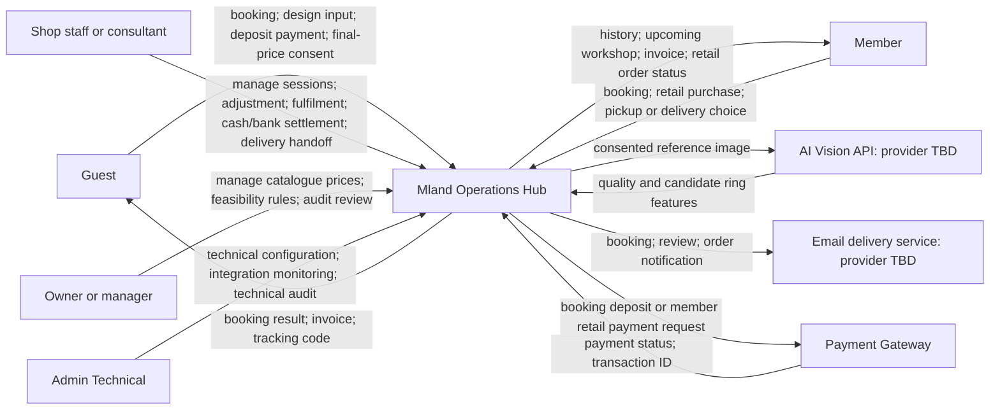

```mermaid
flowchart LR
    Guest[Guest] -->|booking; design input; deposit payment; final-price consent| MOH[Mland Operations Hub]
    MOH -->|booking result; invoice; tracking code| Guest
    Member[Member] -->|booking; retail purchase; pickup or delivery choice| MOH
    MOH -->|history; upcoming workshop; invoice; retail order status| Member
    Staff[Shop staff or consultant] -->|manage sessions; adjustment; fulfilment; cash/bank settlement; delivery handoff| MOH
    Owner[Owner or manager] -->|manage catalogue prices; feasibility rules; audit review| MOH
    Technical[Admin Technical] -->|technical configuration; integration monitoring; technical audit| MOH
    MOH -->|consented reference image| Vision[AI Vision API: provider TBD]
    Vision -->|quality and candidate ring features| MOH
    MOH -->|booking; review; order notification| Email[Email delivery service: provider TBD]
    MOH -->|booking deposit or member retail payment request| Payment[Payment Gateway]
    Payment -->|payment status; transaction ID| MOH
```
