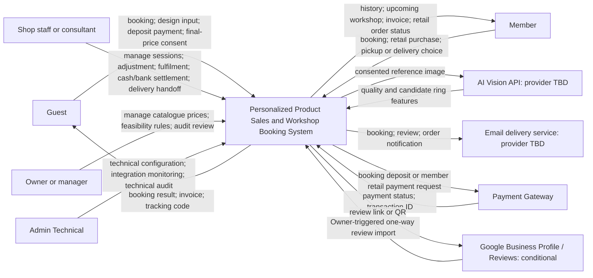

```mermaid
flowchart LR
    Guest[Guest] -->|booking; design input; deposit payment; final-price consent| System[Personalized Product Sales and Workshop Booking System]
    System -->|booking result; invoice; tracking code| Guest
    Member[Member] -->|booking; retail purchase; pickup or delivery choice| System
    System -->|history; upcoming workshop; invoice; retail order status| Member
    Staff[Shop staff or consultant] -->|manage sessions; adjustment; fulfilment; cash/bank settlement; delivery handoff| System
    Owner[Owner or manager] -->|manage catalogue prices; feasibility rules; audit review| System
    Technical[Admin Technical] -->|technical configuration; integration monitoring; technical audit| System
    System -->|consented reference image| Vision[AI Vision API: provider TBD]
    Vision -->|quality and candidate ring features| System
    System -->|booking; review; order notification| Email[Email delivery service: provider TBD]
    System -->|booking deposit or member retail payment request| Payment[Payment Gateway]
    Payment -->|payment status; transaction ID| System
    System -->|review link or QR| Google[Google Business Profile / Reviews: conditional]
    Google -->|Owner-triggered one-way review import| System
```
