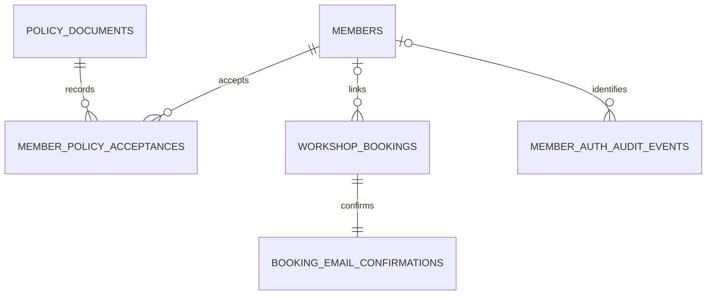
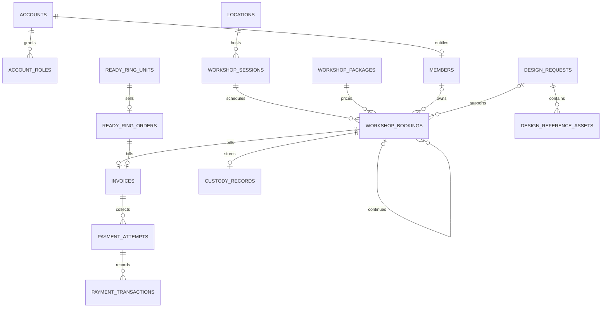

# Mland V1 Database Catalog and Physical Target Design

## 1. Purpose, authority, and maturity

This document records the database in two deliberately separate layers:

1. **As-built** describes the physical schema created by the current Flyway
   migration and the JPA mappings that currently exist.
2. **Proposed V1 target** is a physical design blueprint for later,
   feature-approved migrations. It is not deployed schema and must not be
   treated as an implementation instruction without the owning feature's
   SpecKit/OpenAPI work.

The Flyway migrations under
`ppswbs_backend/src/main/resources/db/migration/` are the physical-schema
source of truth. Feature data models and this catalog explain intent; they do
not override an applied migration.

| Maturity | Meaning |
| --- | --- |
| **As-built** | Present in the current Flyway V1 migration. |
| **Mapped** | An As-built table currently has a JPA entity/repository mapping. |
| **Proposed** | Physical target chosen for V1 but not yet migrated. |
| **TBD dependency** | A provider, governance, retention, or lifecycle rule is not approved; no final persistence behaviour may be assumed. |

## 2. Database platform and change rules

- MySQL 9.7.2 is the pinned baseline for local, CI/integration, staging, and
  production. H2 in MySQL compatibility mode is permitted only for the fast
  test profile and is not runtime or release-compatibility evidence. Hibernate
  DDL is disabled and Flyway runs from the migration classpath.
- Database ppswbs uses two non-root principals: ppswbs_migrator runs Flyway in
  CI/deploy with schema-migration privileges; ppswbs_app is runtime-only with
  least-privilege DML. Credentials are injected through JDBC_* and FLYWAY_*
  variables and are never stored in this catalog, source, fixtures, or logs.
- Tables and columns use `snake_case`; Java persistence uses JPA repositories.
  Application code does not use raw SQL for business persistence.
- Every change is a new, ordered Flyway migration. Never edit or reuse an
  applied migration version, including `V1__init_member_auth.sql`.
- Target primary keys are `BIGINT AUTO_INCREMENT`; cross-table references use
  explicit foreign keys. Historical and audit references use restrictive
  deletion; the target does not use `ON DELETE CASCADE`.
- Money is stored as `amount_vnd BIGINT`, never floating point. State fields
  are `VARCHAR(64)` values controlled by application enums and feature rules.
  Timestamps are `TIMESTAMP`; application and database configuration must use a
  consistent UTC interpretation.
- Audit evidence is append-only and belongs to the domain that performs the
  workflow. `safe_metadata` or equivalent contains only redacted operational
  context—never Firebase ID tokens, password/reset codes, provider secrets, or
  raw payment webhook payloads.
- No shared central business-audit table is part of V1. Google Review import
  remains an integration/governance dependency and has no target table.

## 3. As-built schema: Flyway V1

### 3.1 Migration and current mapping status

`V1__init_member_auth.sql` creates six tables and two effective policy seed
rows. The `members` module currently maps the first four tables through JPA:
`Member`, `PolicyDocument`, `MemberPolicyAcceptance`, and
`MemberAuthAuditEventEntity`. There is currently no `workshopbooking` JPA
entity/repository mapping for `workshop_bookings` or
`booking_email_confirmations`; this is a technical mapping status only.

| Table | Module owner | Maturity | Current JPA mapping |
| --- | --- | --- | --- |
| `members` | `members` | As-built | Mapped: `Member` |
| `policy_documents` | `members` | As-built | Mapped: `PolicyDocument` |
| `member_policy_acceptances` | `members` | As-built | Mapped: `MemberPolicyAcceptance` |
| `member_auth_audit_events` | `members` | As-built | Mapped: `MemberAuthAuditEventEntity` |
| `workshop_bookings` | `workshopbooking` | As-built | Not mapped currently |
| `booking_email_confirmations` | `workshopbooking` | As-built | Not mapped currently |

### 3.2 Tables, columns, and constraints

#### `members`

| Column | Physical definition | Notes |
| --- | --- | --- |
| `id` | `BIGINT AUTO_INCREMENT PRIMARY KEY` | Internal Member identifier. |
| `external_user_id` | `VARCHAR(128) NOT NULL UNIQUE` | Verified Firebase UID; never derived from email. |
| `email` | `VARCHAR(255) NULL` | Mutable profile/contact attribute, never a merge or authorization key. |
| `email_verified` | `BOOLEAN NOT NULL DEFAULT FALSE` | Snapshot of verified Firebase claim. |
| `status` | `VARCHAR(64) NOT NULL DEFAULT 'PENDING_POLICY_ACCEPTANCE'` | Current JPA enum persists as a string. |
| `created_at`, `updated_at` | `TIMESTAMP NOT NULL DEFAULT CURRENT_TIMESTAMP`; `updated_at` has `ON UPDATE CURRENT_TIMESTAMP` | Lifecycle timestamps. |

Index: `idx_members_email (email)`.

#### `policy_documents`

| Column | Physical definition | Notes |
| --- | --- | --- |
| `id` | `BIGINT AUTO_INCREMENT PRIMARY KEY` | Policy document identifier. |
| `policy_type`, `version` | `VARCHAR(64) NOT NULL` each | Unique as a pair. |
| `content_uri` | `VARCHAR(512) NOT NULL` | Published content location. |
| `effective_at` | `TIMESTAMP NOT NULL` | Effective date/time. |
| `state` | `VARCHAR(64) NOT NULL DEFAULT 'EFFECTIVE'` | Current JPA enum persists as a string. |
| `created_at` | `TIMESTAMP NOT NULL DEFAULT CURRENT_TIMESTAMP` | Creation evidence. |

Unique key: `uk_policy_type_version (policy_type, version)`.

#### `member_policy_acceptances`

| Column | Physical definition | Notes |
| --- | --- | --- |
| `id` | `BIGINT AUTO_INCREMENT PRIMARY KEY` | Acceptance identifier. |
| `member_id` | `BIGINT NOT NULL` | FK `fk_mpa_member → members(id)`. |
| `policy_document_id` | `BIGINT NOT NULL` | FK `fk_mpa_policy → policy_documents(id)`. |
| `accepted_at` | `TIMESTAMP NOT NULL DEFAULT CURRENT_TIMESTAMP` | Acceptance evidence time. |
| `locale` | `VARCHAR(16) NOT NULL DEFAULT 'vi'` | Locale at acceptance. |
| `correlation_id` | `VARCHAR(64) NOT NULL` | Request/audit correlation. |

Unique key: `uk_member_policy (member_id, policy_document_id)`.

#### `member_auth_audit_events`

| Column | Physical definition | Notes |
| --- | --- | --- |
| `id` | `BIGINT AUTO_INCREMENT PRIMARY KEY` | Audit event identifier. |
| `member_id` | `BIGINT NULL` | Nullable because some events precede Member creation; no FK is declared in V1. |
| `event_type` | `VARCHAR(64) NOT NULL` | Typed auth event. |
| `occurred_at` | `TIMESTAMP NOT NULL DEFAULT CURRENT_TIMESTAMP` | Event time. |
| `correlation_id` | `VARCHAR(64) NOT NULL` | Request/audit correlation. |
| `provider` | `VARCHAR(64) NULL` | Provider label only. |
| `safe_metadata` | `TEXT NULL` | Redacted metadata only. |

Index: `idx_audit_member_occurred (member_id, occurred_at)`.

#### `workshop_bookings`

| Column | Physical definition | Notes |
| --- | --- | --- |
| `id` | `BIGINT AUTO_INCREMENT PRIMARY KEY` | Booking identifier. |
| `booking_code` | `VARCHAR(64) NOT NULL UNIQUE` | Public lookup identifier. |
| `member_id` | `BIGINT NULL` | FK `fk_wb_member → members(id)`; Guest booking may remain unlinked. |
| `contact_email`, `canonical_email` | `VARCHAR(255) NOT NULL` each | Contact and normalized lookup email. |
| `confirmation_state` | `VARCHAR(64) NOT NULL DEFAULT 'EMAIL_CONFIRMATION_PENDING'` | Email-confirmation lifecycle state. |
| `booking_status` | `VARCHAR(64) NOT NULL DEFAULT 'PENDING'` | Booking lifecycle state. |
| `created_at`, `updated_at` | `TIMESTAMP NOT NULL DEFAULT CURRENT_TIMESTAMP`; `updated_at` has `ON UPDATE CURRENT_TIMESTAMP` | Lifecycle timestamps. |

Index: `idx_bookings_canonical_email (canonical_email)`.

#### `booking_email_confirmations`

| Column | Physical definition | Notes |
| --- | --- | --- |
| `id` | `BIGINT AUTO_INCREMENT PRIMARY KEY` | Confirmation identifier. |
| `booking_id` | `BIGINT NOT NULL UNIQUE` | FK `fk_bec_booking → workshop_bookings(id)`; one confirmation record per booking. |
| `token_hash` | `VARCHAR(128) NOT NULL` | Hash only; plaintext token is never persisted. |
| `expires_at` | `TIMESTAMP NOT NULL` | One-time-token expiry. |
| `confirmed_at` | `TIMESTAMP NULL` | Successful consumption time. |
| `state` | `VARCHAR(64) NOT NULL DEFAULT 'PENDING'` | Confirmation state. |
| `created_at` | `TIMESTAMP NOT NULL DEFAULT CURRENT_TIMESTAMP` | Creation time. |

### 3.3 As-built relationships and seed data

V1 seeds two `policy_documents` rows: `TERMS_OF_USE` and `PRIVACY_POLICY`, both
version `v1.0.0`, state `EFFECTIVE`, and content URIs beneath `/policies/`.
No migration seed includes accounts, roles, payment providers, catalogue data,
or Google Reviews.

## 4. Proposed V1 physical target

All tables in this section are **Proposed — not yet migrated**. Standard target
columns omitted from the compact lists are `created_at TIMESTAMP NOT NULL` and,
for mutable records, `updated_at TIMESTAMP NOT NULL`. Audit tables use only
`occurred_at TIMESTAMP NOT NULL` and do not expose update/delete operations.

### 4.1 Identity, entitlement, and policy (`members`)

| Table | Core physical fields | Keys, relationships, and invariant |
| --- | --- | --- |
| `accounts` | `id BIGINT`, `external_user_id VARCHAR(128)`, `status VARCHAR(64)` | PK `id`; unique `external_user_id`. One verified Firebase identity has one account; Firebase claims do not set Mland roles. |
| `account_roles` | `id BIGINT`, `account_id BIGINT`, `role VARCHAR(64)`, `state VARCHAR(64)`, `granted_by_account_id BIGINT NULL`, `granted_at TIMESTAMP`, `revoked_at TIMESTAMP NULL` | FK to `accounts` for account/granter; unique `(account_id, role)`. Revoke/reactivate the existing assignment for auditable role history. |
| `members` (evolved) | existing fields plus `account_id BIGINT NULL` during compatibility migration | Unique FK `account_id → accounts(id)`. Backfill an account for each existing Member; retain `external_user_id` until the Member feature contract completes the forward migration. |
| policy_documents (evolved) | existing columns plus stored generated effective_policy_type VARCHAR(64) | Retains unique policy_type/version; generated value is policy_type only for EFFECTIVE, otherwise NULL; unique index on it enforces one effective policy per type. |
| `member_policy_acceptances` | existing physical columns | Immutable evidence; unique Member/policy pair. |
| `member_auth_audit_events` | existing physical columns | Append-only auth/audit evidence; add an FK only through a separately approved compatibility migration. |

### 4.2 Catalogue and capacity (`catalogue`, `workshopbooking`, `readyringsales`)

| Table | Core physical fields | Keys, relationships, and invariant |
| --- | --- | --- |
| `locations` | `id`, `code VARCHAR(64)`, `name VARCHAR(255)`, `address_text VARCHAR(512)`, `state VARCHAR(64)` | Unique `code`; branch/location is a catalogue-owned published resource. |
| `workshop_packages` | `id`, `code VARCHAR(64)`, `name VARCHAR(255)`, `description TEXT`, `duration_minutes INT`, `base_price_vnd BIGINT`, `state VARCHAR(64)` | Unique `code`; package price is VND integer. |
| `workshop_sessions` | `id`, `location_id BIGINT`, `starts_at TIMESTAMP`, `ends_at TIMESTAMP`, `capacity INT`, `state VARCHAR(64)` | FK to `locations`; unique `(location_id, starts_at)`; capacity must be positive. |
| `ring_models` | `id`, `code VARCHAR(64)`, `name VARCHAR(255)`, `base_price_vnd BIGINT`, `state VARCHAR(64)` | Unique `code`; Owner-published model path. |
| `ring_components` | `id`, `code VARCHAR(64)`, `component_type VARCHAR(64)`, `name VARCHAR(255)`, `price_delta_vnd BIGINT`, `state VARCHAR(64)` | Unique `code`; component definition only. |
| `ring_model_components` | `id`, `ring_model_id BIGINT`, `ring_component_id BIGINT`, `min_quantity INT`, `max_quantity INT`, `required BOOLEAN` | FKs to model/component; unique `(ring_model_id, ring_component_id)`; `min_quantity <= max_quantity`. |
| `ready_ring_products` | `id`, `sku VARCHAR(64)`, `name VARCHAR(255)`, `description TEXT`, `list_price_vnd BIGINT`, `state VARCHAR(64)` | Unique `sku`; catalogue-owned product definition. |
| `ready_ring_units` | `id`, `ready_ring_product_id BIGINT`, `unit_code VARCHAR(64)`, `availability_status VARCHAR(64)` | FK to product; unique `unit_code`. Unit is the single reservable/sellable physical ring. Reservation/expiry state semantics remain TBD. |

### 4.3 Design review (`designreview`)

| Table | Core physical fields | Keys, relationships, and invariant |
| --- | --- | --- |
| `design_requests` | `id`, `member_id BIGINT NULL`, `booking_id BIGINT NULL`, `guest_reference_code VARCHAR(64) NULL`, `access_token_hash VARCHAR(128) NULL`, `request_type VARCHAR(64)`, `consented_at TIMESTAMP NULL`, `state VARCHAR(64)` | Nullable FK to `members` and later `workshop_bookings`; unique non-null `guest_reference_code`; a reference-image request requires explicit consent before external analysis, and any Guest access token is hashed only. |
| `design_reference_assets` | `id`, `design_request_id BIGINT`, `storage_uri VARCHAR(512)`, `content_sha256 CHAR(64)`, `media_type VARCHAR(128)`, `state VARCHAR(64)` | FK to request; unique `(design_request_id, content_sha256)`. Retention period and storage provider are TBD. |
| `design_request_components` | `id`, `design_request_id BIGINT`, `ring_component_id BIGINT`, `quantity INT` | FKs to request/component; unique `(design_request_id, ring_component_id)`; quantity positive. |
| `feasibility_rules` | `id`, `rule_code VARCHAR(64)`, `rule_version VARCHAR(64)`, `state VARCHAR(64)`, `rule_definition JSON` | Unique `(rule_code, rule_version)`; rule values/thresholds require Owner approval. |
| `feasibility_evaluations` | `id`, `design_request_id BIGINT`, `rule_version VARCHAR(64)`, `route VARCHAR(64)`, `decision VARCHAR(64)`, `candidate_features JSON NULL` | Unique `design_request_id`; AI output remains candidate data only. Candidate-data retention is TBD. |
| `design_review_decisions` | `id`, `design_request_id BIGINT`, `account_id BIGINT`, `decision VARCHAR(64)`, `reason TEXT`, `decision_context JSON NULL` | FKs to request/account; Staff or Owner decision/override is auditable. |
| `design_review_audit_events` | `id`, `design_request_id BIGINT`, `event_type VARCHAR(64)`, `account_id BIGINT NULL`, `correlation_id VARCHAR(64)`, `safe_metadata TEXT NULL` | FKs to request/account; append-only domain audit. |

### 4.4 Booking and confirmation (`workshopbooking`)

| Table | Core physical fields | Keys, relationships, and invariant |
| --- | --- | --- |
| `workshop_bookings` (extended) | existing fields plus `workshop_session_id BIGINT`, `workshop_package_id BIGINT`, `design_request_id BIGINT NULL`, `parent_booking_id BIGINT NULL`, `participant_count INT` | FKs to session/package/design/self. `parent_booking_id` represents a Staff-created continuation; `participant_count` must be positive. Existing booking code and Guest/Member linkage remain unique/optional as in V1. |
| `booking_email_confirmations` | existing physical columns | One hashed confirmation token per booking. Expiry/cancellation workflow remains feature-owned. |
| `booking_audit_events` | `id`, `booking_id BIGINT`, `event_type VARCHAR(64)`, `account_id BIGINT NULL`, `occurred_at TIMESTAMP`, `correlation_id VARCHAR(64)`, `safe_metadata TEXT NULL` | FK to booking and optional account; append-only booking audit. |

### 4.5 Billing and payments (`billing`, `payments`)

| Table | Core physical fields | Keys, relationships, and invariant |
| --- | --- | --- |
| `invoices` | `id`, `invoice_code VARCHAR(64)`, `booking_id BIGINT NULL`, `ready_ring_order_id BIGINT NULL`, `currency_code CHAR(3) DEFAULT 'VND'`, `total_amount_vnd BIGINT`, `deposit_due_vnd BIGINT`, `amount_paid_vnd BIGINT`, `state VARCHAR(64)` | Unique `invoice_code`; FKs to booking/order. A check constraint must require exactly one of booking/order once both relations exist. |
| `invoice_lines` | `id`, `invoice_id BIGINT`, `line_type VARCHAR(64)`, `description VARCHAR(512)`, `quantity INT`, `unit_amount_vnd BIGINT`, `line_amount_vnd BIGINT` | FK to invoice; quantity positive; historical line prices are immutable. |
| `invoice_adjustments` | `id`, `invoice_id BIGINT`, `adjustment_type VARCHAR(64)`, `amount_vnd BIGINT`, `reason TEXT`, `staff_account_id BIGINT`, `owner_account_id BIGINT NULL`, `customer_consented_at TIMESTAMP NULL`, `state VARCHAR(64)` | FKs to invoice/accounts; preserves actor, reason, and consent/approval evidence. |
| `billing_audit_events` | `id`, `invoice_id BIGINT`, `event_type VARCHAR(64)`, `account_id BIGINT NULL`, `correlation_id VARCHAR(64)`, `safe_metadata TEXT NULL` | FK to invoice/account; append-only billing audit. |
| `payment_attempts` | `id`, `invoice_id BIGINT`, `provider VARCHAR(64)`, `requested_amount_vnd BIGINT`, `state VARCHAR(64)`, `provider_reference VARCHAR(255) NULL` | FK to invoice; no browser redirect can set confirmed state. |
| `payment_transactions` | `id`, `payment_attempt_id BIGINT`, `provider VARCHAR(64)`, `provider_transaction_id VARCHAR(255)`, `amount_vnd BIGINT`, `state VARCHAR(64)`, `confirmed_at TIMESTAMP NULL` | FK to attempt; unique `(provider, provider_transaction_id)`. |
| `payment_provider_events` | `id`, `provider VARCHAR(64)`, `provider_event_id VARCHAR(255)`, `payment_transaction_id BIGINT NULL`, `received_at TIMESTAMP`, `verified_at TIMESTAMP NULL`, `payload_sha256 CHAR(64)`, `safe_metadata TEXT NULL`, `state VARCHAR(64)` | Unique `(provider, provider_event_id)`; stores verification evidence and hash, not a raw provider payload. Provider signature, retry, and reconciliation policy remain TBD. |

### 4.6 Ready-ring sales, operations, and fulfilment

| Table | Core physical fields | Keys, relationships, and invariant |
| --- | --- | --- |
| `ready_ring_orders` | `id`, `order_code VARCHAR(64)`, `member_id BIGINT`, `ready_ring_unit_id BIGINT`, `state VARCHAR(64)`, `fulfilment_choice VARCHAR(64)` | Unique `order_code`; FKs to Member/unit. Only an entitled Member may create an order; payment confirmation precedes unit reservation. |
| `ready_ring_sales_audit_events` | `id`, `ready_ring_order_id BIGINT`, `event_type VARCHAR(64)`, `account_id BIGINT NULL`, `correlation_id VARCHAR(64)`, `safe_metadata TEXT NULL` | FK to order/account; append-only sales audit. |
| `workshop_check_ins` | `id`, `booking_id BIGINT`, `staff_account_id BIGINT`, `checked_in_at TIMESTAMP`, `actual_participant_count INT`, `state VARCHAR(64)` | Unique `booking_id`; FKs to booking/account; actual participant count non-negative. |
| `custody_records` | `id`, `booking_id BIGINT`, `work_item_description TEXT`, `intake_photo_uri VARCHAR(512) NULL`, `location_id BIGINT`, `staff_account_id BIGINT`, `state VARCHAR(64)` | FKs to booking/location/account; work-in-progress custody evidence. Image retention is feature-owned. |
| `custody_releases` | `id`, `custody_record_id BIGINT`, `staff_account_id BIGINT`, `released_at TIMESTAMP`, `state VARCHAR(64)` | Unique `custody_record_id`; FKs to custody/account; auditable release/handover. |
| `carrier_handoffs` | `id`, `ready_ring_order_id BIGINT`, `carrier_name VARCHAR(255)`, `handoff_reference VARCHAR(255)`, `staff_account_id BIGINT`, `handed_off_at TIMESTAMP` | Unique `ready_ring_order_id`; FKs to order/account. Carrier tracking, returns, and logistics refunds are out of scope. |
| `fulfilment_audit_events` | `id`, `custody_record_id BIGINT NULL`, `ready_ring_order_id BIGINT NULL`, `event_type VARCHAR(64)`, `account_id BIGINT NULL`, `correlation_id VARCHAR(64)`, `safe_metadata TEXT NULL` | FKs to applicable record/account; a check constraint must require exactly one fulfilment subject. |

### 4.7 Technical administration (`technicaladmin`)

| Table | Core physical fields | Keys, relationships, and invariant |
| --- | --- | --- |
| `technical_configurations` | `id`, `configuration_key VARCHAR(128)`, `display_name VARCHAR(255)`, `safe_value JSON NULL`, `state VARCHAR(64)`, `updated_by_account_id BIGINT` | Unique `configuration_key`; FK to account. Secrets remain environment/secret-manager references, never `safe_value`. Exact configuration set is TBD. |
| `integration_health_checks` | `id`, `integration_key VARCHAR(128)`, `checked_at TIMESTAMP`, `state VARCHAR(64)`, `safe_detail TEXT NULL` | Index `(integration_key, checked_at)`; holds safe observability result only. Monitoring cadence and retention are TBD. |
| `technical_admin_audit_events` | `id`, `account_id BIGINT`, `event_type VARCHAR(64)`, `occurred_at TIMESTAMP`, `correlation_id VARCHAR(64)`, `safe_metadata TEXT NULL` | FK to account; append-only technical audit. No business-record mutation is represented here. |

### 4.8 Target relationship map

## 5. Proposed append-only migration sequence

| Sequence | Migration purpose | Dependencies |
| --- | --- | --- |
| V2 | Create accounts/account_roles; backfill one account per existing Member; add nullable members.account_id, validate uniqueness, and add the generated effective-policy unique key. | Existing members, policy_documents |
| V3 | Create catalogue, location, session, model/component, product, and unit tables. | V2 accounts only for audit ownership where needed |
| V4 | Extend bookings and add design-review tables/audit tables. | V3 sessions/packages/components; existing bookings |
| V5 | Add ready-ring orders, invoices, adjustments, payment attempts/transactions/provider-event evidence, and billing/sales audit. | V3 units, V4 bookings, V2 Members; create orders before invoice FKs. |
| V6 | Add check-ins, continuation/custody/release/carrier handoff, and fulfilment audit. | V3 locations, V4 bookings, V5 orders |
| V7 | Add non-secret technical configuration, health, and technical-audit tables. | V2 accounts |

The exact migration version number may advance as approved feature migrations are
added. Each migration must be owned by its business module and tested on an
empty MySQL database plus the supported upgrade path.

## 6. Open dependencies and delivery gate

| Area | Status before implementation |
| --- | --- |
| Payment gateway signature, payload, retries, reconciliation, refunds | TBD dependency; define provider contract before creating provider integration. |
| Ready-ring reservation/expiry policy | TBD dependency; define allowed unit-state transitions and concurrency protection. |
| AI reference-image storage, feature output, and retention | TBD dependency; define consent, storage, deletion, and visibility policy. |
| Technical configuration inventory, health retention, secret references | TBD dependency; no secrets may enter the database. |
| Google Review import | No table in V1 target; requires separate retention/attribution/appeal approval. |

Before a Proposed table becomes a migration, its feature must define the
request/API contract, authorization, validation, state transitions, audit
evidence, data retention, concurrency/idempotency rule, and rollback/upgrade
test. No target row changes the current migration or runtime schema by itself.
