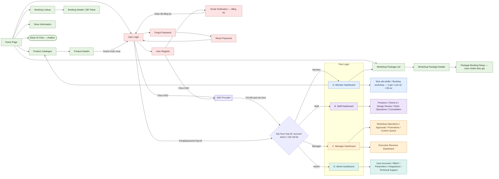
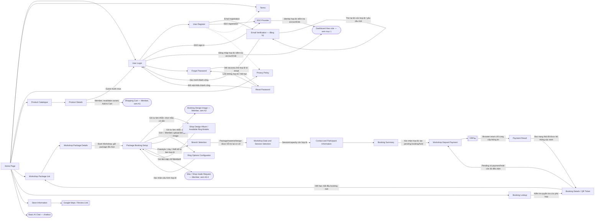
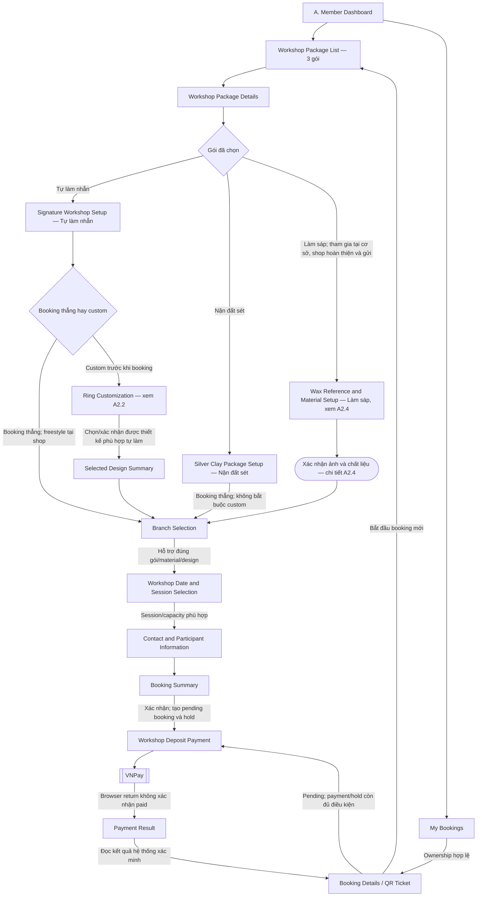
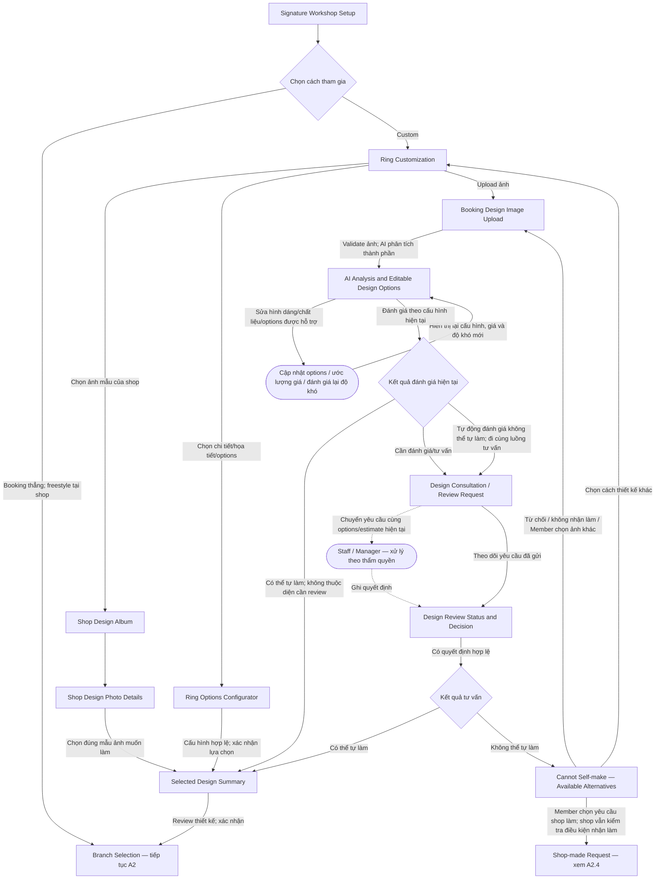
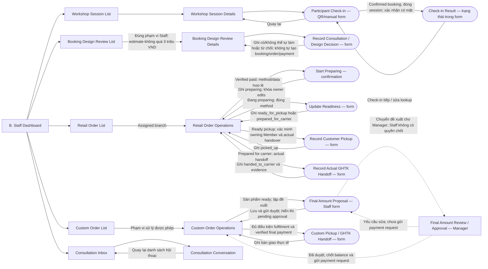
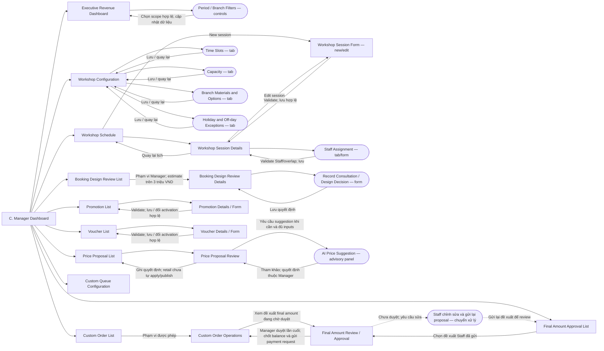
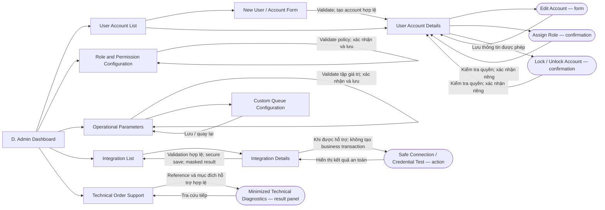

# Mland — Screen Flow

Sơ đồ điều hướng toàn hệ thống, gồm các màn public/authentication và bốn điểm vào sau đăng nhập: **Member Dashboard**, **Staff Dashboard**, **Manager Dashboard**, **Admin Dashboard**. Các nhánh chi tiết bên dưới mở rộng sơ đồ tổng quan; tên màn trùng nhau giữa các sơ đồ chỉ cùng một màn hoặc cùng một bố cục theo quyền.

## Quy ước

- Hình chữ nhật: màn hình; hình bo tròn: tab, bước trong form, popup hoặc hành động được ghi rõ trên nhãn.
- Hình thoi: điều kiện điều hướng, không phải một màn hình.
- Khung kép: giao diện của hệ thống bên ngoài.
- Mũi tên liền: mở màn, gửi form hoặc quay lại; nhãn trên mũi tên nêu điều kiện cần thiết.
- Mũi tên đứt: chuyển xử lý giữa vai trò hoặc mở nội dung tham khảo, không cấp quyền truy cập vào màn của vai trò khác.
- Các nút và dữ liệu phải được kiểm tra quyền ở từng lần truy cập/submission. Member chỉ thao tác trên dữ liệu của mình; Staff xử lý retail order trong assigned branch; Manager thực hiện hành động được ủy quyền khi nghiệp vụ yêu cầu.

**Phạm vi đã chốt:** Revenue Dashboard chỉ dành cho Manager. Các chức năng bổ sung từ draft Member Authentication không được đưa vào sơ đồ: Policy Acceptance gate, liên kết thêm phương thức đăng nhập, import Guest bookings và xác nhận email booking trước thanh toán. Đăng ký, đăng nhập, xác minh đăng ký, khôi phục và đổi mật khẩu vẫn được thể hiện theo Account Management trong Report 3.

## 1. Tổng quan — Public → Authentication → Post Login

Các ô nhóm chức năng bên phải Dashboard là điểm dẫn tới những nhánh chi tiết bên dưới, không phải các màn mới bắt buộc phải xây dựng.

## 2. Public và authentication — chi tiết

- Chọn package và hoàn tất nhánh thiết kế tương ứng trước khi vào Branch Selection → Date/Session → Contact/Participants → Booking Summary → Deposit. Cơ sở được chọn phải hỗ trợ package/material/design; thay cơ sở hoặc thiết kế yêu cầu kiểm tra lại lựa chọn liên quan.
- Guest có thể đặt workshop theo quyền hiện có, nhưng không upload booking-design image, mua retail hoặc tạo yêu cầu shop chế tác. Nhánh làm sáp/shop làm của Member được thể hiện riêng tại A2.4.
- Booking confirmed mới hiển thị QR. Tra cứu Guest dùng bằng chứng truy cập phù hợp; Member truy cập bằng ownership. Link email mở lại Booking Details, không phải một màn nghiệp vụ mới.
- Đăng ký/xác thực lỗi giữ người dùng tại màn hiện tại với hướng dẫn an toàn. Recovery không tiết lộ sự tồn tại của tài khoản.
- Terms và Privacy là nội dung public; sơ đồ không thêm một Policy Acceptance gate từ draft Member Authentication.

## 3. A. Member Dashboard

Member có **hai hành trình chính**:

1. **Mua sản phẩm**: catalogue → cart → retail checkout → payment → nhận hàng.
2. **Booking workshop**: chọn một trong ba gói **Tự làm nhẫn**, **Nặn đất sét**, **Làm sáp** → hoàn tất nhánh của gói → các bước đặt lịch/thông tin/thanh toán tương ứng.

Profile, loyalty, consultation và lịch sử là các chức năng hỗ trợ. Yêu cầu shop làm được mở từ nhánh thiết kế không thể tự làm hoặc gói làm sáp; không phải một hành trình chính thứ ba song song với mua sản phẩm và booking.

### A1. Retail, hồ sơ, loyalty và tư vấn

- Retail Checkout revalidate toàn cart, hiển thị branch/variant/quantity/prices/benefits/payable trước khi chấp nhận. Không tạo partial order.
- Cart chỉ giữ giá tham khảo. Accepted order giữ frozen terms; payment link 10 phút và hold 15 phút dùng deadline gốc, không kéo dài khi mở lại màn.
- Fulfilment Selection chỉ mở sau verified paid và trước preparing. Chọn GHTK yêu cầu recipient data; preparation khóa việc sửa phương thức/dữ liệu. Không đổi processing branch qua form này.
- Order Details hiển thị payment, hold và fulfilment riêng; không có courier tracking. Payment pending/expired/exception là trạng thái của màn, không phải đường tắt tới fulfilment.
- Profile chỉ của Member hiện tại. Password form chỉ áp dụng cho credential đủ điều kiện; SSO-managed credentials được quản lý tại provider. Consultation là văn bản, không bắt buộc gắn booking/order.

### A2. Booking workshop — ba gói

Luồng trực tiếp tại cơ sở: **Chọn gói → hoàn tất lựa chọn thiết kế nếu có → chọn cơ sở → chọn ngày/session → điền thông tin → review booking → thanh toán cọc → xem booking/QR**.

| Gói | Màn/lựa chọn trước bước đặt lịch | Đường đi |
| --- | --- | --- |
| Tự làm nhẫn — booking thẳng | Signature Workshop Setup → chọn freestyle | Đến shop tự thiết kế; đi thẳng Branch Selection, không buộc chọn ảnh/options trước. |
| Tự làm nhẫn — custom | Ring Customization → album shop, options hoặc upload image | Hoàn tất thiết kế phù hợp → Selected Design Summary → Branch Selection. Thiết kế không tự làm được có nhánh yêu cầu shop làm. |
| Nặn đất sét | Silver Clay Package Setup | Booking thẳng → Branch Selection, không chèn bước custom bắt buộc. |
| Làm sáp | Wax Reference and Material Setup | Upload ảnh tham chiếu, chọn chất liệu → chọn cơ sở/lịch tham gia → đặt cọc → tham gia workshop → shop hoàn thiện và gửi; chi tiết A2.4. |

- Chỉ bắt đầu booking/seat hold sau khi review và submit booking hợp lệ; thời gian phân tích/tư vấn trước đó không tự tiêu thụ cửa sổ thanh toán.
- Booking Summary hiển thị package, cơ sở, lịch, số người, contact, design đã chọn nếu có, các khoản giá được phép và tiền cọc trước khi xác nhận. Theo hợp đồng hiện có, workshop deposit bằng 50% package; link 10 phút, hold 15 phút. Không lấy giá ước lượng thiết kế làm số tiền phải thu khi chưa có quy tắc được duyệt.
- Lỗi cơ sở không hỗ trợ design/material, lịch hết chỗ hoặc contact không hợp lệ dẫn về bước cần sửa; thay đổi liên quan phải được kiểm tra lại. QR chỉ hiển thị sau booking confirmed.

### A2.2. Tự làm nhẫn — freestyle và ba nhánh custom

| Màn | Nội dung và luồng |
| --- | --- |
| Signature Workshop Setup | Chọn booking thẳng để freestyle tại shop hoặc custom trước. |
| Ring Customization | Ba lối vào: album mẫu shop, configurator options, upload ảnh. |
| Shop Design Album / Photo Details | Chọn ảnh mẫu shop; preview và xác nhận mẫu muốn tự làm. Album này phục vụ thiết kế workshop, không phải hành động mua sản phẩm retail. |
| Ring Options Configurator | Chọn chi tiết/họa tiết và các options được hỗ trợ → xem cấu hình/giá theo quy tắc hiện có → xác nhận → Selected Design Summary. |
| Booking Design Image Upload | Upload ảnh ý tưởng → kiểm tra file/context → phân tích. Ảnh không hợp lệ hoặc xử lý lỗi cho phép thử ảnh khác. |
| AI Analysis and Editable Design Options | Hiển thị các thành phần nhận diện, shape/material/options, giá ước lượng và độ khó. Khi sửa options, cập nhật estimate và đánh giá độ khó theo cấu hình mới; không tiếp tục với kết quả của cấu hình cũ. |
| Design Consultation / Review Request | Gửi cấu hình hiện tại để tư vấn, xem trạng thái chờ và kết quả. Chờ review chưa tạo booking/hold. |
| Cannot Self-make — Available Alternatives | Cho Member chọn yêu cầu shop làm hoặc quay lại upload/chọn thiết kế khác. Yêu cầu shop làm không tự được chấp nhận hay chuyển thanh toán. |
| Selected Design Summary | Review mẫu/options đã chốt → Branch Selection → chọn lịch → thông tin → thanh toán như A2. |

- Ba kết quả đánh giá theo mô tả mới: **có thể tự làm**, **cần đánh giá tư vấn**, **tự động đánh giá không thể tự làm**. Hai kết quả sau đi vào cùng luồng tư vấn; kết quả cuối có thể cho phép tự làm hoặc chuyển sang phương án shop làm/ảnh khác.
- AI cung cấp thành phần tham khảo; ứng dụng áp dụng các quy tắc đánh giá/giá được cấu hình. Giá cập nhật theo options là **ước lượng thiết kế**, không phải AI tự publish giá catalogue hay tự chấp nhận custom-manufacturing order.
- Quyền human review giữ theo tài liệu hiện có: Staff trong ngưỡng cho phép; Manager cho request trên 3.000.000 VND hoặc thuộc diện Manager review. Không tự cấp quyền override từ kết quả AI.
- Sửa options sau review làm thay đổi nội dung đã được đánh giá thì phải tính/đánh giá lại và xin review mới khi cần; không dùng approval cũ cho cấu hình khác.

### A2.3. Nặn đất sét — booking thẳng

**Silver Clay Package Setup → Branch Selection → Workshop Date and Session Selection → Contact and Participant Information → Booking Summary → Workshop Deposit Payment → VNPay → Payment Result → Booking Details / QR Ticket.**

Nhánh này dùng lại chuỗi màn của sơ đồ A2; không bắt buộc album, ring configurator, upload ảnh hoặc AI analysis.

### A2.4. Làm sáp và yêu cầu shop làm

Hai điểm vào có ý nghĩa khác nhau:

- **Gói Làm sáp**: Member upload ảnh, chọn chất liệu, chọn cơ sở và **ngày/session tham gia workshop**, điền thông tin và thanh toán cọc. Member đến tham gia; shop hoàn thiện sản phẩm sau đó và gửi hàng.
- **Yêu cầu shop làm từ tư vấn nhẫn**: Member chọn rõ phương án shop làm. Thiết kế được mang sang request để kiểm tra điều kiện nhận làm theo luồng chế tác; không tự chuyển thành đăng ký tham gia workshop wax. Ngày mong muốn hoàn thành của request này vẫn khác ngày tham gia workshop.

```mermaid
flowchart LR
    Wax["Wax Reference and Material Setup"]
    FromRing["Shop-made Request — từ nhánh không thể tự làm"]
    Input["Reference Image and Material Selection"]
    Branch["Processing Branch Selection"]
    Context{"Journey đã chọn"}
    Schedule["Wax Workshop Date and Session Selection"]
    Deadline["Requested Completion Date — nếu có, chỉ request shop làm"]
    Contact["Contact / Participants / Recipient Information — theo journey"]
    Summary["Booking or Request Summary / Deposit Quote"]
    Deposit["Deposit Payment — theo booking/request context"]
    GatewayDeposit[["VNPay — deposit"]]
    DepositResult["Payment Result — deposit"]
    Mine["My Bookings"]
    Orders(["Shop-made Orders — tab/list trong lịch sử"])
    BookingDetails["Wax Booking Details / QR Ticket"]
    Details["Shop Completion / Custom Order Details"]
    Balance["Custom Balance Payment"]
    GatewayBalance[["VNPay — balance"]]
    BalanceResult["Payment Result — balance"]
    Attend(["Member tham gia workshop; Staff check-in theo quyền"])
    Shop(["Shop hoàn thiện sản phẩm"])
    StaffProposal(["Staff lập đề xuất final amount và gửi Manager"])
    ManagerApproval(["Manager Final Amount Review / Approval"])
    Handoff(["Shop ghi actual pickup / manual GHTK handoff"])

    Wax -->|"Upload ảnh tham chiếu; chọn chất liệu được hỗ trợ"| Input
    FromRing -->|"Mang sang thiết kế đã chọn; Member review và bổ sung"| Input
    Input -->|"Xác nhận ảnh/cấu hình và chất liệu"| Branch --> Context
    Context -->|"Gói làm sáp; lịch khách đến cơ sở"| Schedule
    Context -->|"Chỉ yêu cầu shop làm"| Deadline
    Schedule -->|"Session/capacity phù hợp"| Contact
    Deadline -->|"Deadline/queue capacity phù hợp"| Contact
    Contact --> Summary
    Summary -->|"Điều kiện/quote hợp lệ; Member xác nhận"| Deposit
    Summary -->|"Không đủ điều kiện nhận làm / dữ liệu cần sửa"| Input
    Deposit --> GatewayDeposit --> DepositResult
    DepositResult -->|"Booking wax: đọc payment facts; confirmed mới có QR"| BookingDetails
    DepositResult -->|"Request shop làm: đọc payment facts đã xác minh"| Details
    Mine -->|"Own wax booking"| BookingDetails
    BookingDetails -->|"Xem phần shop hoàn thiện của booking này"| Details
    BookingDetails -.->|"Đến ngày tham gia; booking confirmed"| Attend
    Attend -.->|"Sau hoạt động workshop"| Shop
    Mine --> Orders -->|"Own order"| Details
    Details -.->|"Request chỉ shop làm; deposit hợp lệ và đủ điều kiện"| Shop
    Shop -.->|"Sản phẩm ready"| StaffProposal
    StaffProposal -.->|"Chờ Manager duyệt lần cuối"| ManagerApproval
    ManagerApproval -.->|"Cần chỉnh sửa; chưa gửi payment request"| StaffProposal
    ManagerApproval -.->|"Đã duyệt; chốt balance và gửi payment request"| Details
    Details -->|"Final balance đã được Manager duyệt; đủ điều kiện thanh toán"| Balance
    Balance --> GatewayBalance --> BalanceResult
    BalanceResult -->|"Hiển thị payment facts đã xác minh"| Details
    Details -.->|"Verified final payment và đủ điều kiện fulfilment"| Handoff
    Handoff -.->|"Ghi kết quả bàn giao, không phải courier tracking"| Details
```

- Làm sáp cho upload ảnh ý tưởng bất kỳ về mặt lựa chọn mẫu, vẫn phải kiểm tra file và các yêu cầu kỹ thuật. Khách chọn chất liệu; màn summary hiển thị số tiền cọc theo chính sách/quote được áp dụng, không tự hiểu là khách nhập một số tiền cọc tùy ý.
- Lịch của gói làm sáp đã được người dùng xác nhận là **ngày tham gia workshop tại cơ sở**, không phải deadline giao/hoàn thành. Luồng là ảnh/chất liệu → cơ sở → lịch/session → thông tin → summary → cọc → booking confirmed/QR → tham gia → shop hoàn thiện → final payment nếu còn phải thu → gửi hàng. Không tự thêm quy tắc bắt buộc hai session từ poster khi số buổi và cách xếp lịch chưa được chốt.
- Deadline/queue capacity trong custom-manufacturing contract áp dụng cho request shop làm theo điều kiện hiện có; không thay thế kiểm tra session/capacity của wax workshop. Contract hiện có nêu deposit bằng 50% wax-package và final balance bằng remaining 50% cộng actual surcharges. Cách material/estimate mới ảnh hưởng quote/cọc cần được đồng bộ nếu khác contract này; không tự thay bằng 50% AI estimate.
- Reference image của yêu cầu shop làm là dữ liệu phục vụ chế tác theo retention riêng, khác AI image input bị xóa sau xử lý. AI không nhận quyền quyết định nhận làm hoặc tự chốt final manufacturing amount.
- Với wax, shop hoàn thiện sau khi Member tham gia; request chỉ shop làm đi vào thực hiện sau deposit hợp lệ và các điều kiện nhận làm. Khi ready, Staff lập đề xuất số tiền cuối và gửi Manager duyệt. Chỉ sau Manager approval mới chốt balance, gửi payment request và cho Member thanh toán; verified balance là điều kiện trước actual handoff. Thiết kế/material của wax booking được mang sang phần hoàn thiện, không yêu cầu Member upload lại hoặc thanh toán lại cùng khoản cọc.
- Cần đồng bộ cách liên kết wax booking với phần shop hoàn thiện, payment purpose và resource reservation trong Report 3. Sơ đồ chỉ thể hiện hành trình; không tự quyết định phải tạo hai đơn, thu hai cọc hay giữ đồng thời hai loại tài nguyên. Handoff ghi thủ công; không thêm GHTK tracking/API hoặc tự động báo delivered.

## 4. B. Staff Dashboard

### B1. Product management

Giá proposal, approval, application và publication là các hành động riêng. Used variant options và frozen purchase history không bị viết lại; quantity edit không được xâm phạm active holds. Publish không tự phát sinh từ save hoặc approval.

### B2. Workshop, design review, retail/custom operations và consultation

- Retail không có manual paid override, skip/backward transition hoặc courier delivery status.
- Pickup yêu cầu owning Member đăng nhập và mở đúng order tại quầy cùng actual handover; screenshot/reference đơn lẻ không đủ.
- Prepared for carrier khác actual handoff. GHTK chỉ được ghi nhận bàn giao thủ công, không có API/fee quote/tracking.
- Các màn session/list/custom operations là cách gom điều hướng đề xuất; dữ liệu và hành động phải giới hạn theo thẩm quyền đã xác định, không suy ra quyền đọc toàn hệ thống.
- Kết quả tư vấn thiết kế được Member xem tại A2.2. Không thể tự làm dẫn tới màn phương án thay thế; chỉ khi Member chọn yêu cầu shop làm mới đi tiếp A2.4, và shop vẫn kiểm tra điều kiện nhận làm.
- Staff chỉ lập/sửa và gửi **Final Amount Proposal**, không chốt số tiền cuối hoặc gửi payment request từ đề xuất chưa duyệt. Manager review là chuyển xử lý giữa vai trò, không phải màn Staff được quyền mở. Cần chỉnh sửa thì quay lại đề xuất; sửa nội dung đã duyệt phải được Manager duyệt lại trước khi dùng để yêu cầu thanh toán.

## 5. C. Manager Dashboard

- Revenue Dashboard chỉ hiển thị dữ liệu trong period/branch scope được phép; dữ liệu thiếu/chậm phải được đánh dấu.
- Workshop settings và schedule edits bảo vệ bookings/holds hiện có. Enabled Klook synchronization là xử lý hệ thống; có thể hiển thị trạng thái liên quan trong workshop screens, không thêm màn cancellation hoặc reconciliation.
- AI price suggestion hỗ trợ giá package/product, không phải giá custom manufacturing. Với retail, Manager approval vẫn cần authorized maintainer apply riêng và publication riêng.
- Product maintenance và retail-order operations của Manager chỉ mở khi có explicit applicable delegation. Khi có quyền, dùng lại màn B tương ứng; Dashboard không mặc định cấp các quyền này.
- **Final Amount Approval** là quyết định cuối của Manager đối với đề xuất Staff gửi lên. Trong lúc chờ duyệt hoặc cần chỉnh sửa, Member chưa được nhận yêu cầu thanh toán cho đề xuất đó. Số tiền dùng cho payment request phải đúng bản đã được Manager duyệt.

## 6. D. Admin Dashboard

- Admin không có đường vào Revenue Dashboard, quyền xác nhận thanh toán hay business approval mặc định.
- Assign Role và Lock/Unlock là hành động riêng; Edit Account không âm thầm thay đổi role/status. RBAC chỉ thay đổi các permission được hỗ trợ, không tạo quyền nghiệp vụ chưa được duyệt.
- Integration Details che secrets và không hiển thị credentials trong logs/errors.
- Technical Support chỉ hiển thị internal order/attempt reference, branch code, timestamps, states và sanitized technical codes. Không hiển thị cart/product/options hoặc customer identity/contact/address/notes, không impersonation hoặc business mutation.

## 7. Hành vi chung

- Session hết hạn dẫn về User Login; dữ liệu bảo vệ chỉ được đọc lại sau khi kiểm tra quyền. Tài khoản inactive/locked hoặc không đủ quyền nhận kết quả từ chối an toàn.
- Validation/save failure giữ trạng thái đã lưu; edit xung đột yêu cầu tải lại/review. Empty/error/pending là trạng thái trong màn, không được hiển thị như success.
- Browser return không xác nhận payment. IPN/eligible QueryDR là xử lý phía hệ thống; kết quả được đọc trong Payment Result và booking/order details. Không tạo màn IPN, QueryDR hoặc payment reconciliation.
- Email thất bại không đảo ngược một payment/booking/order hợp lệ. Email links mở màn chi tiết với đúng access checks; không thêm Notification Center.
- Logout là hành động trong account menu của cả bốn Dashboard, kết thúc phiên và về Home/Login. Không cần một trang Logout riêng.
- Dữ liệu recipient và media hiển thị theo chính sách retention; không lộ lại dữ liệu đã đến hạn retire qua màn details hoặc technical support.

## 8. Căn cứ và điểm cần đồng bộ

- Phân quyền số tiền cuối theo xác nhận mới của người dùng: **Staff lập đề xuất → gửi Manager → Manager duyệt lần cuối → chốt balance/gửi payment request → Member thanh toán**. Nội dung cũ trong Report 2 và UC63 ghi Staff hoặc Manager ghi final amount cần được đồng bộ riêng; sơ đồ này không còn cho Staff tự chốt.
- [Use-case inventory](../documents/docs/report-3-software-requirement-specification/sections/03-i-overall-requirements/04-user-requirements/02-use-cases.md), [Actors](../documents/docs/report-3-software-requirement-specification/sections/03-i-overall-requirements/04-user-requirements/01-actors.md), [Permission Matrix](../documents/docs/report-3-software-requirement-specification/sections/03-i-overall-requirements/04-user-requirements/04-permission-matrix.md).
- [Product Management](../documents/docs/report-3-software-requirement-specification/sections/04-ii-use-case-specifications/02-product-management/00-overview.md), [Workshop Management](../documents/docs/report-3-software-requirement-specification/sections/04-ii-use-case-specifications/03-workshop-management/00-overview.md), [Order Management](../documents/docs/report-3-software-requirement-specification/sections/04-ii-use-case-specifications/08-order-management-and-fulfillment/00-overview.md).
- [Business rules](../documents/docs/report-3-software-requirement-specification/sections/07-v-requirement-appendix/01-business-rules.md), [V1 scope](../documents/docs/report-2-project-management-plan/sections/02-i-project-overview/01-scope-purpose.md).
- Quyết định của người dùng cho sơ đồ này: dùng bốn tên Dashboard, không đưa các chức năng bổ sung trong draft Member Authentication vào flow, Admin không được xem Revenue Dashboard. Permission Matrix còn ghi Admin Full cho executive dashboard và cần được đồng bộ trong một thay đổi tài liệu riêng.
- Làm rõ mới của người dùng cho phần Member: hai hành trình chính là mua sản phẩm và booking ba gói; nhẫn có freestyle/album/options/upload ảnh, clay booking thẳng, wax upload reference/chọn chất liệu, tham gia workshop tại cơ sở rồi shop hoàn thiện và gửi hàng. Ngày chọn cho wax là ngày tham gia, đã được người dùng xác nhận. Nhánh AI có thể tự làm / cần tư vấn / không thể tự làm và cập nhật estimate khi đổi options thay thế mô tả routing mơ hồ trước đó trong sơ đồ; Report 3 cần đồng bộ riêng. Image-specific consent trong UC30 chưa thống nhất với general Terms/Privacy trong scope nên không tự thêm consent screen.
- Cần chốt số session/cách xếp lịch wax, liên kết booking với shop completion/resource reservation và ảnh hưởng của material/estimated design price tới deposit quote nếu khác quy tắc hiện có. Không coi deadline chế tác là lịch tham gia. Giá, phụ thu và thời gian trên ảnh không tự trở thành các giá trị vận hành hardcode trong sơ đồ.
- Tên UI **Price Proposal Review** diễn đạt đúng phạm vi product/package của UC31. **Prepared for carrier** và **actual carrier handoff** được thể hiện riêng để tránh nhầm tên UC53 với sự kiện bàn giao thực tế.
