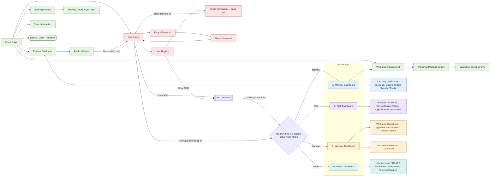
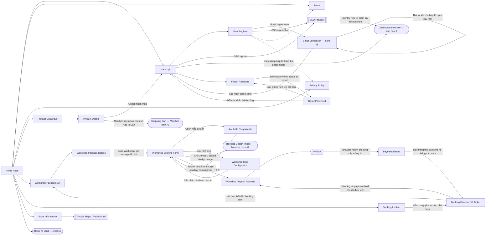
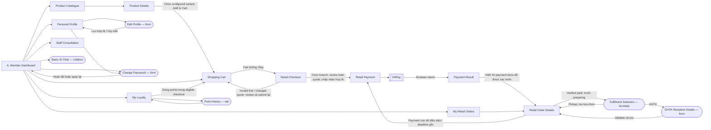
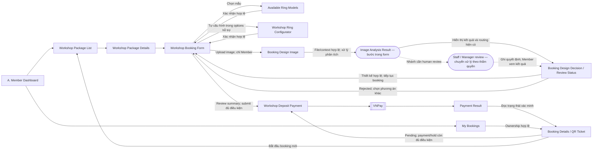
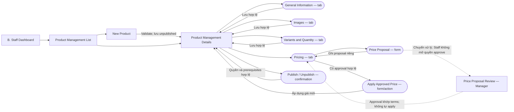
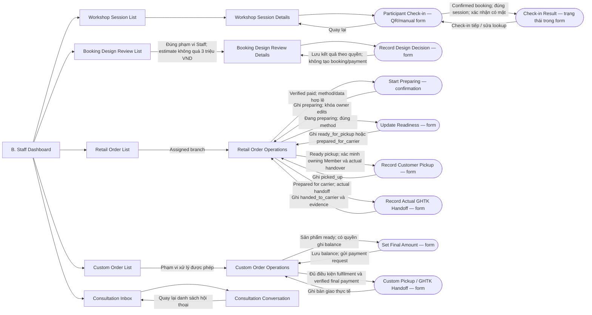
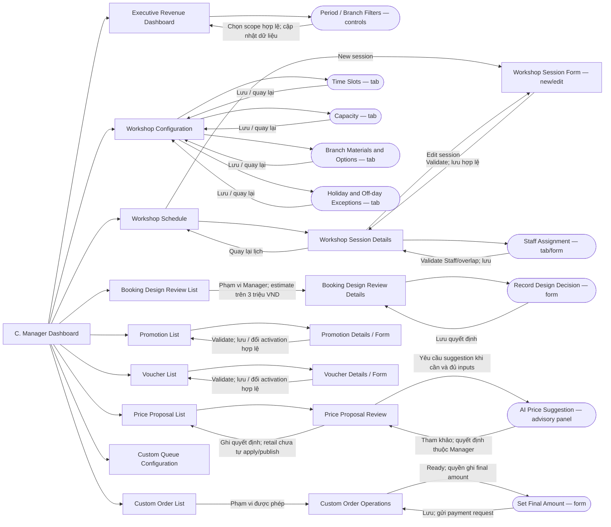

# Mland — Screen Flow

Sơ đồ điều hướng toàn hệ thống, gồm các màn public/authentication và bốn điểm vào sau đăng nhập: **Member Dashboard**, **Staff Dashboard**, **Manager Dashboard**, **Admin Dashboard**. Các nhánh chi tiết bên dưới mở rộng sơ đồ tổng quan; tên màn trùng nhau giữa các sơ đồ chỉ cùng một màn hoặc cùng một bố cục theo quyền.

## Quy ước

- Hình chữ nhật: màn hình; hình bo tròn: tab, bước trong form, popup hoặc hành động được ghi rõ trên nhãn.
- Hình thoi: điều kiện điều hướng, không phải một màn hình.
- Khung kép: giao diện của hệ thống bên ngoài.
- Mũi tên liền: mở màn, gửi form hoặc quay lại; nhãn trên mũi tên nêu điều kiện cần thiết.
- Mũi tên đứt: chuyển xử lý giữa vai trò hoặc mở nội dung tham khảo, không cấp quyền truy cập vào màn của vai trò khác.
- Các nút và dữ liệu phải được kiểm tra quyền ở từng lần truy cập/submission. Member chỉ thao tác trên dữ liệu của mình; Staff xử lý retail order trong assigned branch; Manager thực hiện hành động được ủy quyền khi nghiệp vụ yêu cầu.

**Phạm vi đã chốt:** Revenue Dashboard chỉ dành cho Manager. Các chức năng bổ sung từ draft Member Authentication không được đưa vào sơ đồ: Policy Acceptance gate, liên kết thêm phương thức đăng nhập, import Guest bookings và xác nhận email booking trước thanh toán. Đăng ký, đăng nhập, xác minh đăng ký, khôi phục và đổi mật khẩu vẫn được thể hiện theo Account Management trong Report 3.

## 1. Tổng quan — Public → Authentication → Post Login

Các ô nhóm chức năng bên phải Dashboard là điểm dẫn tới những nhánh chi tiết bên dưới, không phải các màn mới bắt buộc phải xây dựng.

## 2. Public và authentication — chi tiết

- Package phải được chọn trước khi chốt session/design path. Guest có thể đặt workshop, nhưng không upload booking-design image, mua retail hoặc tạo custom-manufacturing order.
- Booking confirmed mới hiển thị QR. Tra cứu Guest dùng bằng chứng truy cập phù hợp; Member truy cập bằng ownership. Link email mở lại Booking Details, không phải một màn nghiệp vụ mới.
- Đăng ký/xác thực lỗi giữ người dùng tại màn hiện tại với hướng dẫn an toàn. Recovery không tiết lộ sự tồn tại của tài khoản.
- Terms và Privacy là nội dung public; sơ đồ không thêm một Policy Acceptance gate từ draft Member Authentication.

## 3. A. Member Dashboard

### A1. Retail, hồ sơ, loyalty và tư vấn

- Retail Checkout revalidate toàn cart, hiển thị branch/variant/quantity/prices/benefits/payable trước khi chấp nhận. Không tạo partial order.
- Cart chỉ giữ giá tham khảo. Accepted order giữ frozen terms; payment link 10 phút và hold 15 phút dùng deadline gốc, không kéo dài khi mở lại màn.
- Fulfilment Selection chỉ mở sau verified paid và trước preparing. Chọn GHTK yêu cầu recipient data; preparation khóa việc sửa phương thức/dữ liệu. Không đổi processing branch qua form này.
- Order Details hiển thị payment, hold và fulfilment riêng; không có courier tracking. Payment pending/expired/exception là trạng thái của màn, không phải đường tắt tới fulfilment.
- Profile chỉ của Member hiện tại. Password form chỉ áp dụng cho credential đủ điều kiện; SSO-managed credentials được quản lý tại provider. Consultation là văn bản, không bắt buộc gắn booking/order.

### A2. Workshop và booking-design image

- Ring models, configurator, booking form, payment và Booking Details được dùng lại từ public journey; Member có thêm nhánh upload image và ownership/history.
- Review pending giữ trạng thái chờ; quyết định thiết kế không tự tạo booking hoặc payment.
- Routing chi tiết của UC30 còn cần đồng bộ với business rules: Simple auto-accept và image-specific consent trong UC30 chưa được coi là quyết định thống nhất. Sơ đồ thể hiện màn kết quả/routing và nhánh cần human review, không tự chốt nhánh auto-accept hay một consent screen riêng.

### A3. Custom manufacturing

```mermaid
flowchart LR
    A["A. Member Dashboard"]
    Mine["My Custom Orders"]
    New["New Custom Order"]
    Input(["Reference Image / Manual Configuration — phần trong form"])
    Terms(["Requested Deadline / Fulfilment Data — phần trong form"])
    Deposit["Custom Deposit Payment"]
    GatewayDeposit[["VNPay — deposit"]]
    DepositResult["Payment Result — deposit"]
    Details["Custom Order Details"]
    Balance["Custom Balance Payment"]
    GatewayBalance[["VNPay — balance"]]
    BalanceResult["Payment Result — balance"]

    A --> Mine -->|"Chọn own order"| Details
    A --> New
    Mine --> New
    New --> Input --> Terms
    Terms -->|"Submit; deadline hợp lệ và queue còn capacity"| Deposit
    Terms -->|"Deadline / capacity / dữ liệu không hợp lệ"| New
    Deposit --> GatewayDeposit --> DepositResult
    DepositResult -->|"Hiển thị trạng thái xác minh"| Details
    Details -->|"Final balance đã được ghi; đủ điều kiện thanh toán"| Balance
    Balance --> GatewayBalance --> BalanceResult
    BalanceResult -->|"Hiển thị trạng thái xác minh"| Details
```

- Custom manufacturing là journey riêng; AI không định giá, approve/reject hoặc quyết định feasibility của đơn này.
- Member chọn phương thức nhận khi submit custom order. Deposit bằng 50% wax-package. Final balance là remaining 50% cộng actual surcharges do Staff/Manager ghi khi ready.
- Deposit queue hold tuân thủ payment contract; sau successful deposit, queue slot tiếp tục được giữ tới actual pickup/handoff. Final-balance payment không được vẽ thành thao tác tạo một queue reservation mới.
- Member xem trạng thái và kết quả fulfilment trong Details; việc ghi actual pickup/handoff thuộc shop-side operations.

## 4. B. Staff Dashboard

### B1. Product management

Giá proposal, approval, application và publication là các hành động riêng. Used variant options và frozen purchase history không bị viết lại; quantity edit không được xâm phạm active holds. Publish không tự phát sinh từ save hoặc approval.

### B2. Workshop, design review, retail/custom operations và consultation

- Retail không có manual paid override, skip/backward transition hoặc courier delivery status.
- Pickup yêu cầu owning Member đăng nhập và mở đúng order tại quầy cùng actual handover; screenshot/reference đơn lẻ không đủ.
- Prepared for carrier khác actual handoff. GHTK chỉ được ghi nhận bàn giao thủ công, không có API/fee quote/tracking.
- Các màn session/list/custom operations là cách gom điều hướng đề xuất; dữ liệu và hành động phải giới hạn theo thẩm quyền đã xác định, không suy ra quyền đọc toàn hệ thống.

## 5. C. Manager Dashboard

- Revenue Dashboard chỉ hiển thị dữ liệu trong period/branch scope được phép; dữ liệu thiếu/chậm phải được đánh dấu.
- Workshop settings và schedule edits bảo vệ bookings/holds hiện có. Enabled Klook synchronization là xử lý hệ thống; có thể hiển thị trạng thái liên quan trong workshop screens, không thêm màn cancellation hoặc reconciliation.
- AI price suggestion hỗ trợ giá package/product, không phải giá custom manufacturing. Với retail, Manager approval vẫn cần authorized maintainer apply riêng và publication riêng.
- Product maintenance và retail-order operations của Manager chỉ mở khi có explicit applicable delegation. Khi có quyền, dùng lại màn B tương ứng; Dashboard không mặc định cấp các quyền này.

## 6. D. Admin Dashboard

- Admin không có đường vào Revenue Dashboard, quyền xác nhận thanh toán hay business approval mặc định.
- Assign Role và Lock/Unlock là hành động riêng; Edit Account không âm thầm thay đổi role/status. RBAC chỉ thay đổi các permission được hỗ trợ, không tạo quyền nghiệp vụ chưa được duyệt.
- Integration Details che secrets và không hiển thị credentials trong logs/errors.
- Technical Support chỉ hiển thị internal order/attempt reference, branch code, timestamps, states và sanitized technical codes. Không hiển thị cart/product/options hoặc customer identity/contact/address/notes, không impersonation hoặc business mutation.

## 7. Hành vi chung

- Session hết hạn dẫn về User Login; dữ liệu bảo vệ chỉ được đọc lại sau khi kiểm tra quyền. Tài khoản inactive/locked hoặc không đủ quyền nhận kết quả từ chối an toàn.
- Validation/save failure giữ trạng thái đã lưu; edit xung đột yêu cầu tải lại/review. Empty/error/pending là trạng thái trong màn, không được hiển thị như success.
- Browser return không xác nhận payment. IPN/eligible QueryDR là xử lý phía hệ thống; kết quả được đọc trong Payment Result và booking/order details. Không tạo màn IPN, QueryDR hoặc payment reconciliation.
- Email thất bại không đảo ngược một payment/booking/order hợp lệ. Email links mở màn chi tiết với đúng access checks; không thêm Notification Center.
- Logout là hành động trong account menu của cả bốn Dashboard, kết thúc phiên và về Home/Login. Không cần một trang Logout riêng.
- Dữ liệu recipient và media hiển thị theo chính sách retention; không lộ lại dữ liệu đã đến hạn retire qua màn details hoặc technical support.

## 8. Căn cứ và điểm cần đồng bộ

- [Use-case inventory](../documents/docs/report-3-software-requirement-specification/sections/03-i-overall-requirements/04-user-requirements/02-use-cases.md), [Actors](../documents/docs/report-3-software-requirement-specification/sections/03-i-overall-requirements/04-user-requirements/01-actors.md), [Permission Matrix](../documents/docs/report-3-software-requirement-specification/sections/03-i-overall-requirements/04-user-requirements/04-permission-matrix.md).
- [Product Management](../documents/docs/report-3-software-requirement-specification/sections/04-ii-use-case-specifications/02-product-management/00-overview.md), [Workshop Management](../documents/docs/report-3-software-requirement-specification/sections/04-ii-use-case-specifications/03-workshop-management/00-overview.md), [Order Management](../documents/docs/report-3-software-requirement-specification/sections/04-ii-use-case-specifications/08-order-management-and-fulfillment/00-overview.md).
- [Business rules](../documents/docs/report-3-software-requirement-specification/sections/07-v-requirement-appendix/01-business-rules.md), [V1 scope](../documents/docs/report-2-project-management-plan/sections/02-i-project-overview/01-scope-purpose.md).
- Quyết định của người dùng cho sơ đồ này: dùng bốn tên Dashboard, không đưa các chức năng bổ sung trong draft Member Authentication vào flow, Admin không được xem Revenue Dashboard. Permission Matrix còn ghi Admin Full cho executive dashboard và cần được đồng bộ trong một thay đổi tài liệu riêng.
- UC30 còn khác business rules/scope ở image-specific consent và Simple auto-accept; sơ đồ không tự giải quyết mâu thuẫn đó. Những quyền override hoặc routing khác chưa được chốt không được thêm thành đường đi mặc định.
- Tên UI **Price Proposal Review** diễn đạt đúng phạm vi product/package của UC31. **Prepared for carrier** và **actual carrier handoff** được thể hiện riêng để tránh nhầm tên UC53 với sự kiện bàn giao thực tế.
